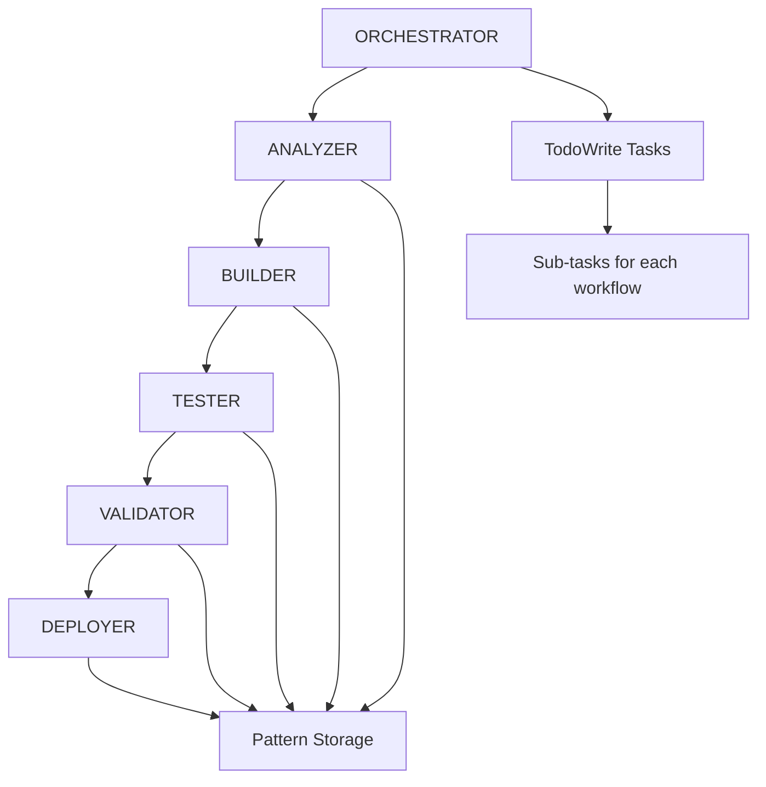

# Omni-Hub Automated Development Workflows

## Overview

This directory contains specialized workflows for automated omni-hub feature development. Each workflow focuses on a single aspect of the development lifecycle, enabling rapid creation of high-quality features with minimal human intervention.

## Workflow System Architecture

### Core Philosophy
- **Ultra-Specialization**: Each workflow does ONE thing perfectly
- **Task Management**: Development tracking through TodoWrite/TodoRead
- **Pattern-Driven**: Learn from every feature creation
- **Quality First**: Automated testing and validation

### Available Workflows

1. **ORCHESTRATOR** - Project management and workflow coordination
2. **ANALYZER** - Requirements analysis and planning
3. **BUILDER** - Feature implementation and coding
4. **TESTER** - Comprehensive testing and coverage
5. **VALIDATOR** - Quality assurance and compliance
6. **DEPLOYER** - Package, deploy, and monitor

## Quick Start

### Creating a New Feature

To create a new feature, use the ORCHESTRATOR workflow:

```
Create a new {channel integration|service|API endpoint} for {name} that {description}.
API documentation: {API spec URL or documentation link}
Authentication: {auth method - API key, Bearer token, etc.]
Priority: {high|medium|low}
```

Example:
```
Create a new channel integration for Telegram that enables message handling and media support.
API documentation: https://core.telegram.org/bots/api
Authentication: Bot token
Priority: high
```

### Workflow Execution Flow



## Detailed Workflow Guide

### 1. ORCHESTRATOR Workflow

**Purpose**: Coordinate all workflows and manage the development process

**Triggers**:
- New feature request
- Enhancement request
- Bug fix coordination

**Key Actions**:
- Creates TodoWrite tasks for each workflow
- Searches codebase for similar patterns
- Coordinates workflow execution
- Tracks progress and metrics

**Example Input**:
```
Orchestrate development of a Telegram channel integration with message handling, media support, and user management capabilities. Use Bot API authentication.
```

### 2. ANALYZER Workflow

**Purpose**: Analyze requirements and create implementation plan

**Inputs from ORCHESTRATOR**:
- Feature requirements
- API documentation
- Similar feature references

**Outputs**:
- `docs/qa/analysis-{feature_name}.md`
- Implementation checklist
- Risk assessment
- Pattern recommendations

**Key Activities**:
- Parse API specifications
- Identify similar existing modules
- Create file structure plan
- Define testing strategy

### 3. BUILDER Workflow

**Purpose**: Implement the feature following specifications

**Inputs from ANALYZER**:
- Implementation plan
- Pattern recommendations
- File structure

**Outputs**:
- Complete feature in `src/`
- Configuration updates
- Basic documentation

**Key Files Created**:
- `handler.py` - Webhook handlers
- `models.py` - Pydantic models
- `client.py` - API clients
- Configuration updates

### 4. TESTER Workflow

**Purpose**: Create comprehensive test suite

**Inputs from BUILDER**:
- Implemented feature code
- Function list
- Configuration details

**Outputs**:
- Test files in `tests/`
- Coverage report (>80% target)
- Test results

**Test Categories**:
- Unit tests
- Integration tests
- Webhook tests
- Mock external APIs
- Async operation tests

### 5. VALIDATOR Workflow

**Purpose**: Ensure quality standards and compliance

**Inputs from TESTER**:
- Test results
- Coverage report
- Feature implementation

**Outputs**:
- `docs/qa/validation-{feature_name}.md`
- Fixed/formatted code
- Compliance checklist

**Validation Areas**:
- Code quality (lint, format)
- FastAPI best practices
- Async/await patterns
- Documentation completeness
- Security review

### 6. DEPLOYER Workflow

**Purpose**: Package and deploy the feature

**Inputs from VALIDATOR**:
- Validated feature
- Version requirements
- Deployment targets

**Outputs**:
- Docker configuration
- Deployment scripts
- Updated documentation
- Release notes

**Deployment Options**:
- Docker containers
- Systemd services
- Cloud deployment
- Local development

## Pattern System Integration

The workflows use the codebase patterns to store and retrieve:

### Pattern Storage
```json
{
  "feature_name": "telegram",
  "patterns_used": ["webhook_handler", "async_client", "pydantic_models"],
  "implementation_time": "3 hours",
  "test_coverage": "87%"
}
```

### Learning from Failures
- Previous implementation attempts
- Common error patterns
- Successful fixes
- Performance optimizations

### Reusable Components
- Webhook handler patterns
- API client patterns
- Error handling strategies
- Test mocking approaches
- Configuration templates

## Task Management

### Task Structure
```
[EPIC] Feature Name - Description
├── ANALYZER: Requirements & Design
├── BUILDER: Implementation
├── TESTER: Test Suite
├── VALIDATOR: Quality Checks
└── DEPLOYER: Package & Deploy
```

### Task Updates
Each workflow updates its task with:
- Progress status
- Completion checklist
- Output artifacts
- Next steps

## Best Practices

### For Humans Using the System

1. **Provide Clear Requirements**
   - Include API documentation links
   - Specify authentication methods
   - List key features needed
   - Set priority level

2. **Monitor Progress**
   - Check TodoRead() status
   - Review workflow outputs
   - Approve when needed

3. **Review Patterns**
   - Check what's been learned
   - Identify reuse opportunities
   - Update patterns when needed

### For Workflow Development

1. **Keep Workflows Focused**
   - Single responsibility
   - Clear inputs/outputs
   - Defined success criteria

2. **Store Everything Useful**
   - Successful patterns
   - Time metrics
   - Common issues
   - Solutions

3. **Fail Fast and Learn**
   - Detect issues early
   - Store failure patterns
   - Improve next time

## Success Metrics

### Target Performance
- **Feature Creation**: <4 hours total
- **Code Coverage**: >80% critical paths
- **Pattern Reuse**: >70%
- **First Success**: >90%
- **Human Touches**: <2 per feature

### Current Performance
Track in documentation:
- Average feature creation time
- Success rates by feature type
- Common failure points
- Improvement trends

## Troubleshooting

### Common Issues

1. **API Specification Issues**
   - Solution: Manually review and clean API docs
   - Update ANALYZER with findings

2. **Authentication Complexity**
   - Solution: Reference similar integration patterns
   - May need human guidance

3. **Test Coverage Low**
   - Solution: Add more edge cases
   - Focus on error scenarios

4. **Deployment Failures**
   - Solution: Check Docker build
   - Verify environment variables

## Future Enhancements

### Planned Improvements
1. **Auto-discovery** of APIs without documentation
2. **Self-healing** when APIs change
3. **Multi-channel** orchestration
4. **Performance** optimization workflow
5. **Security** audit workflow

### Contributing
To improve the workflows:
1. Identify repetitive tasks
2. Document patterns
3. Update workflow prompts
4. Test improvements
5. Measure impact

## Quick Reference

### Start New Feature
```
@ORCHESTRATOR Create channel integration for [Service] with [features]. Docs: [URL]
```

### Check Progress
```
TodoRead()
```

### Deploy Feature
```
@DEPLOYER Deploy [feature_name] using Docker
```

### Common Patterns
- Webhook handlers: See `whatsapp` channel
- API clients: See `agent_api_client`, `evolution_api_sender`  
- Async patterns: See handler implementations
- Testing: See existing test files

## Omni-Hub Specific Considerations

### Architecture
- **Webhook-based**: All integrations use webhooks
- **Async-first**: All operations are async/await
- **Multi-channel**: Support multiple messaging platforms
- **Agent-powered**: All messages processed by AI agents

### Key Integrations
- **Evolution API**: WhatsApp gateway
- **Agent API**: AI processing backend
- **Audio Transcription**: Voice message support
- **Multi-tenancy**: Future support planned

### Configuration
All features use environment-based configuration:
- API keys and URLs in `.env`
- Pydantic Settings for validation
- Type-safe configuration classes

---

*Remember: The goal is to transform any messaging platform into an AI-powered communication channel with minimal human intervention. Every feature we create makes the platform more powerful and versatile!*