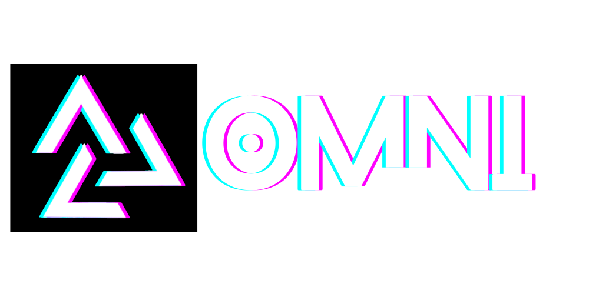
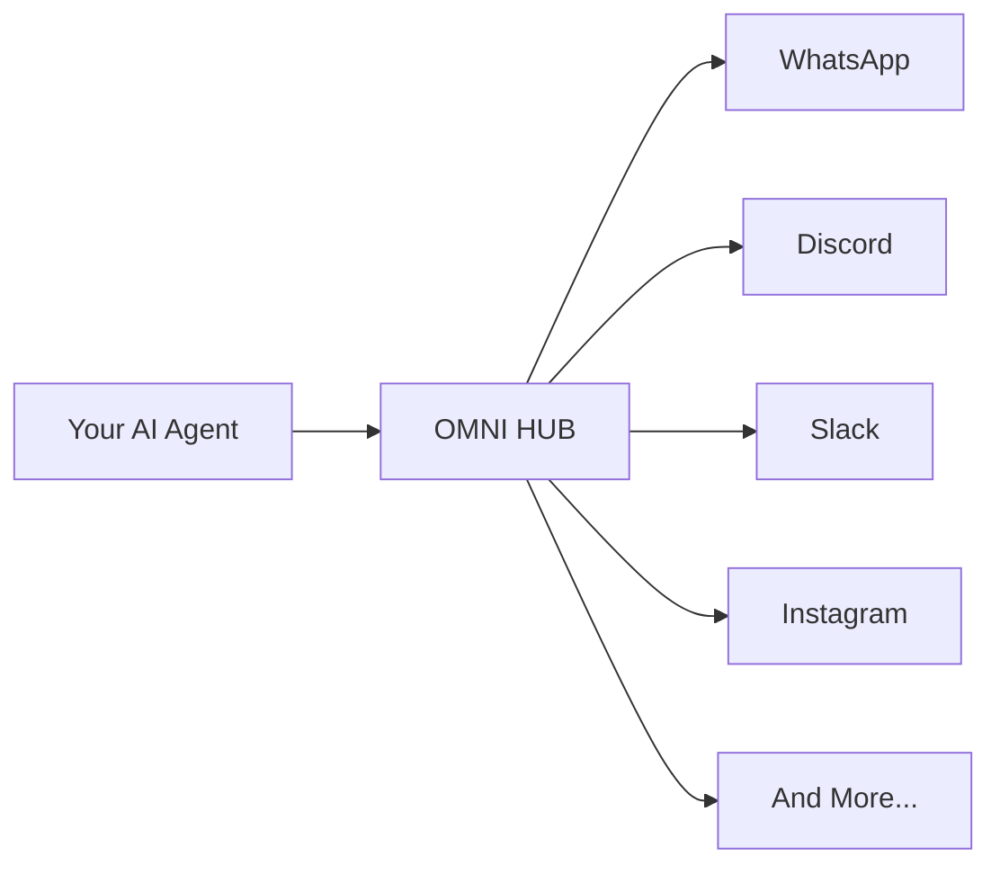

<p align="center">
  <a href="https://omni.automag.ik">
    
  </a>
</p>
<h2 align="center">The Omnipresent Multi-Channel Messaging Hub for AI Agents</h2>

<p align="center">
  <strong>🌐 One Integration, All Channels, Zero Headaches</strong><br>
  Connect your AI agents to WhatsApp, Discord, Slack, and more through a unified API,<br>
  with complete multi-tenant isolation, message tracing, and production-grade reliability
</p>

<p align="center">
  <a href="https://www.npmjs.com/package/automagik-omni"></a>
  <a href="https://github.com/namastexlabs/automagik-omni/actions"></a>
  <a href="https://github.com/namastexlabs/automagik-omni/blob/main/LICENSE"></a>
  <a href="https://discord.gg/automagik"></a>
</p>

<p align="center">
  <a href="#-what-is-automagik-omni">What is Omni?</a> •
  <a href="#-key-features">Features</a> •
  <a href="#-quick-start">Quick Start</a> •
  <a href="#-supported-channels">Channels</a> •
  <a href="#-roadmap">Roadmap</a> •
  <a href="#-contributing">Contributing</a>
</p>


---

## 🚀 What is Automagik Omni?

**Automagik Omni** is the intelligent messaging hub that connects your AI agents to the world. Think of it as a **specialized postman** that knows every address (messaging platform), speaks every language (protocol), and ensures your AI's messages reach users wherever they are.

### 🎯 The Problem We Solve

**"Integrating with multiple messaging platforms is a developer's nightmare"**

Developers face:
- 🔄 Multiple APIs to learn and maintain
- 🏗️ Separate integrations for each platform
- 📝 Duplicated code across channels
- 🌀 Growing complexity with each new platform
- ⏰ Procrastination: *"Slack integration? I'll do that later..."*

### ✨ The Omni Solution

**One integration, all channels, zero headaches**



### 🌟 The Omnipresent Vision

Our dream: **True agent omnipresence** - like talking to the same person across different apps:
- 📱 "I saw something on Instagram, help me with it on WhatsApp"
- 🔄 Seamless context continuity between platforms
- 👤 The agent knows who you are, regardless of where you message

*Current reality: We're "present" on multiple platforms. Next goal: True omnipresence with shared context.*

---

## 🌟 Key Features

### Production Ready Today
- **🔌 Plug & Play**: Install, configure, and run in under 5 minutes
- **🏢 Multi-Tenant**: Complete isolation between instances
- **📊 Full Tracing**: Every message tracked from input to output
- **🔐 Secure**: API key authentication, input validation, CORS controls
- **🤖 MCP Native**: Control everything via Model Context Protocol
- **🚀 Production Scale**: Handle 100+ instances, hundreds of concurrent messages

### Channel Support
- ✅ **WhatsApp** (Evolution API): Text, media, audio, stickers, reactions
- ✅ **Discord** (Bot + IPC): Multi-server, attachments, Unix socket communication
- 🔄 **Slack**: Coming Q4 2025
- 📅 **Instagram, Telegram, Teams**: Q1-Q2 2026

### Developer Experience
- **Zero Dependencies**: Use only what you need
- **Unified API**: Same endpoints for all channels
- **Real-time Streaming**: SSE support for Hive agents
- **Comprehensive Logging**: Know exactly what's happening
- **Docker & PM2 Ready**: Deploy however you prefer

---

## 📦 Quick Start

### Prerequisites

- Node.js 18+ or Python 3.11+
- PostgreSQL or SQLite
- Evolution API instance (for WhatsApp)
- Discord bot token (for Discord)

### Installation

```bash
# Clone the repository
git clone https://github.com/namastexlabs/automagik-omni.git
cd automagik-omni

# Install with UV (recommended - fast Python package manager)
make install

# Or traditional pip
pip install -r requirements.txt

# Set up environment
cp .env.example .env
# Edit .env with your configuration

# Run database migrations
make migrate

# Start the service
make dev
# Or with PM2
pm2 start ecosystem.config.js
```

### Your First Instance

```bash
# 1. API is running at http://localhost:8000
curl http://localhost:8000/health

# 2. Create a WhatsApp instance
curl -X POST http://localhost:8000/api/v1/instances \
  -H "x-api-key: your-api-key" \
  -H "Content-Type: application/json" \
  -d '{
    "name": "my-assistant",
    "channel_type": "whatsapp",
    "evolution_url": "https://your-evolution.com",
    "evolution_api_key": "your-evolution-key",
    "agent_url": "https://your-agent.com",
    "agent_api_key": "your-agent-key"
  }'

# 3. Get QR Code for WhatsApp
curl http://localhost:8000/api/v1/instances/my-assistant/qr \
  -H "x-api-key: your-api-key"

# 4. You're connected! Messages flow automatically
```

---

## 🔗 Supported Channels

### ✅ WhatsApp (Production Ready)
- **Integration**: Evolution API
- **Features**: QR login, text/media/audio, reactions, quotes, presence
- **Management**: Connect/disconnect, status monitoring, profile updates

### ✅ Discord (Production Ready)
- **Integration**: Discord.py bot with IPC
- **Features**: Multi-server, text/attachments, voice infrastructure
- **Management**: CLI controls, Unix socket communication

### 🔄 Coming Soon

| Channel | Timeline | Status |
|---------|----------|--------|
| Slack | Q4 2025 | In Development |
| WhatsApp Business | Q4 2025 | Planned |
| Instagram Direct | Q1 2026 | Planned |
| Telegram | Q1 2026 | Planned |
| Microsoft Teams | Q1 2026 | Planned |
| LinkedIn Messages | 2026-2027 | Research |
| WeChat | 2026-2027 | Research |

---

## 🤖 Agent Integration

Omni works seamlessly with the Automagik ecosystem:

### Automagik Hive
Multi-agent workflow engine with streaming SSE support
```python
# Omni automatically handles Hive's streaming responses
# Formats them appropriately for each channel
```

### Any OpenAPI-Compatible Agent
```json
{
  "agent_url": "https://your-agent.com/chat",
  "agent_api_key": "your-key",
  "agent_type": "custom"
}
```

### MCP Control
Manage instances and send messages from any MCP-compatible tool:
```javascript
// From Claude, Cursor, or any MCP client
mcp.manage_instances({ operation: "list" })
mcp.send_message({ 
  message_type: "text",
  phone: "+1234567890",
  message: "Hello from MCP!"
})
```

---

## 📡 MCP Server

Omni includes a built-in MCP server for remote control from AI coding agents.

### Available Tools

| Tool | Description | Example |
|------|-------------|---------|
| `manage_instances` | CRUD operations on instances | List, create, update, delete |
| `send_message` | Send messages to any channel | Text, media, reactions |
| `manage_traces` | View message history | Analytics, debugging |
| `manage_profiles` | User profile management | Fetch info, update pictures |

### Configuration Example (Claude Code)

```json
{
  "mcpServers": {
    "omni": {
      "command": "python",
      "args": ["-m", "mcp_local_omni"],
      "env": {
        "OMNI_URL": "http://localhost:8000",
        "OMNI_API_KEY": "your-api-key"
      }
    }
  }
}
```

---

## 🛠️ API Reference

### Core Endpoints

#### Instance Management
```http
GET    /api/v1/instances              # List all instances
POST   /api/v1/instances              # Create new instance
GET    /api/v1/instances/{name}       # Get instance details
PUT    /api/v1/instances/{name}       # Update instance
DELETE /api/v1/instances/{name}       # Delete instance

# Channel Operations
GET    /api/v1/instances/{name}/qr    # Get WhatsApp QR
GET    /api/v1/instances/{name}/status # Connection status
POST   /api/v1/instances/{name}/connect    # Connect
POST   /api/v1/instances/{name}/disconnect # Disconnect
```

#### Messaging
```http
POST /api/v1/instance/{name}/send-text      # Send text message
POST /api/v1/instance/{name}/send-media     # Send image/video
POST /api/v1/instance/{name}/send-audio     # Send audio
POST /api/v1/instance/{name}/send-sticker   # Send sticker
POST /api/v1/instance/{name}/send-reaction  # Send reaction
```

#### Traces & Analytics
```http
GET  /api/v1/traces                          # List traces
GET  /api/v1/traces/{id}                     # Get trace details
GET  /api/v1/traces/analytics/summary        # Analytics summary
POST /api/v1/traces/cleanup                  # Clean old traces
```

---

## 🗺️ Roadmap

### Q4 2025 - Immediate Priorities
- 🎯 **Robustness & Scale**: Beyond Evolution API limitations
- 📋 **Access Control**: Whitelist/blacklist system
- 💼 **WhatsApp Business**: Flows for enterprise
- 💬 **Slack Integration**: Most requested feature
- 🔄 **Fallback System**: Multiple WhatsApp engines

### Q1-Q2 2026 - Expansion & Omnipresence
- 📱 **Instagram Direct**
- ✈️ **Telegram**
- 👔 **Microsoft Teams**
- 🌟 **True Omnipresence**: Shared context across all channels
- 👤 **Unified User Management**: Link same person everywhere

### 2026-2027 - Complete Vision
- 💼 **LinkedIn Messages**
- 🇨🇳 **WeChat**
- 🎵 **TikTok DMs**
- 📱 **SMS Gateway**
- 🔌 **Open Architecture**: Connect any agent system
- 🌍 **Global Scale**: Enterprise-ready infrastructure

---

## 🚀 Development

### Running Locally

```bash
# Development mode with hot reload
make dev

# Run tests
make test

# View logs
make logs

# Database operations
make migrate        # Run migrations
make db-reset      # Reset database
```

### Docker Deployment

```bash
# Build and run with Docker Compose
docker-compose up -d

# View container logs
docker-compose logs -f omni-api
```

### CLI Tools

```bash
# Instance management
automagik-omni instance list
automagik-omni instance add --name my-bot --type whatsapp
automagik-omni instance set-default my-bot

# Discord bot management
automagik-omni discord start my-discord
automagik-omni discord status
automagik-omni discord stop my-discord

# Health check
automagik-omni health
```

---

## 🤝 Contributing

We love contributions! Please read our [Contributing Guide](CONTRIBUTING.md) first.

### How to Contribute

1. **Fork & Clone**: Fork the repo and clone locally
2. **Branch**: Create a feature branch (`feature/amazing-feature`)
3. **Commit**: Use conventional commits (`feat:`, `fix:`, `docs:`)
4. **Test**: Ensure all tests pass
5. **PR**: Open a pull request with clear description

### Development Setup

```bash
# Clone your fork
git clone https://github.com/YOUR_USERNAME/automagik-omni.git
cd automagik-omni

# Install dependencies
make install

# Create feature branch
git checkout -b feature/my-feature

# Run tests
make test

# Submit PR when ready!
```

---

## 🙏 Acknowledgments

Special thanks to:
- Evolution API team for WhatsApp infrastructure
- Discord.py community for excellent bot framework
- All our contributors and early adopters

---

## 📄 License

MIT License - see [LICENSE](LICENSE) file for details.

---

## 🔗 Links

- **Website**: [omni.automag.ik](https://omni.automag.ik)
- **Documentation**: [docs.automag.ik/omni](https://docs.automag.ik/omni)
- **GitHub**: [github.com/namastexlabs/automagik-omni](https://github.com/namastexlabs/automagik-omni)
- **Discord**: [discord.gg/automagik](https://discord.gg/automagik)
- **Twitter**: [@automagikdev](https://twitter.com/automagikdev)

---

<p align="center">
  <strong>🌐 Connect your AI to every messaging platform with one integration</strong><br>
  <strong>The omnipresent messaging hub that just works™</strong><br><br>
  <a href="https://github.com/namastexlabs/automagik-omni">Star us on GitHub</a> • 
  <a href="https://discord.gg/automagik">Join our Discord</a>
</p>

<p align="center">
  Made with ❤️ by <a href="https://namastex.ai">Namastex Labs</a><br>
  <em>Building bridges between AI and humans, one message at a time</em>
</p>