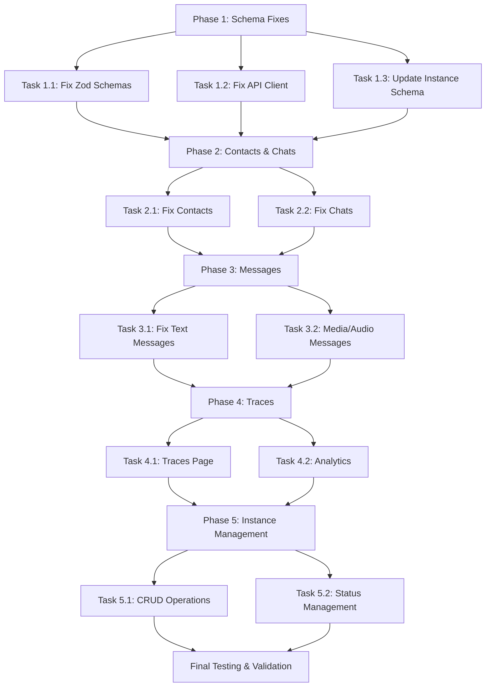

# Automagik Omni UI Implementation Plan

**Created:** 2025-10-21
**API Base:** http://localhost:8882
**API Key:** namastex888
**Test Phone:** +555197285829

---

## 🔍 Current Status Analysis

### Critical Issues Identified

1. **Zod Schema Validation Errors**
   - `TypeError: Cannot read properties of undefined (reading '_zod')`
   - Caused by circular references in `z.lazy()` usage
   - Files affected: `ui/lib/conveyor/schemas/omni-schema.ts`

2. **API Endpoint Mismatches**
   - Message sending using wrong endpoint: `/api/v1/omni/` (404) instead of `/api/v1/instance/{instance_name}/send-text`
   - Contacts/Chats fetching using wrong paths: `/api/v1/omni/` instead of `/api/v1/instances/{instance_name}/`

3. **Response Schema Mismatches**
   - Backend returns field names that don't match UI expectations
   - Example: `evolution_url` vs `evolution_api_url`, `whatsapp_instance` vs `evolution_instance_name`

### Working Components

✅ Instances page loads and displays data
✅ API authentication working
✅ Electron app compiling and running
✅ UI framework (React, Tailwind, shadcn/ui) functional

---

## 📋 API Endpoint Mapping (from OpenAPI)

### Instances
- `GET /api/v1/instances` - List all instances
- `POST /api/v1/instances` - Create instance
- `GET /api/v1/instances/{instance_name}` - Get instance details
- `PUT /api/v1/instances/{instance_name}` - Update instance
- `DELETE /api/v1/instances/{instance_name}` - Delete instance
- `GET /api/v1/instances/{instance_name}/status` - Get connection status
- `GET /api/v1/instances/{instance_name}/qr` - Get QR code
- `POST /api/v1/instances/{instance_name}/connect` - Connect instance
- `POST /api/v1/instances/{instance_name}/disconnect` - Disconnect instance
- `POST /api/v1/instances/{instance_name}/restart` - Restart instance
- `POST /api/v1/instances/{instance_name}/logout` - Logout instance

### Contacts
- `GET /api/v1/instances/{instance_name}/contacts` - List contacts
  - Query params: `page`, `page_size`, `search_query`, `status_filter`, `channel_type`
- `GET /api/v1/instances/{instance_name}/contacts/{contact_id}` - Get contact details

### Chats
- `GET /api/v1/instances/{instance_name}/chats` - List chats
  - Query params: `page`, `page_size`, `chat_type_filter`, `archived`, `channel_type`
- `GET /api/v1/instances/{instance_name}/chats/{chat_id}` - Get chat details

### Messages
- `POST /api/v1/instance/{instance_name}/send-text` - Send text message
- `POST /api/v1/instance/{instance_name}/send-media` - Send media message
- `POST /api/v1/instance/{instance_name}/send-audio` - Send audio message
- `POST /api/v1/instance/{instance_name}/send-sticker` - Send sticker
- `POST /api/v1/instance/{instance_name}/send-contact` - Send contact
- `POST /api/v1/instance/{instance_name}/send-reaction` - Send reaction

### Profiles
- `POST /api/v1/instance/{instance_name}/fetch-profile` - Fetch user profile
- `POST /api/v1/instance/{instance_name}/update-profile-picture` - Update profile picture

### Traces
- `GET /api/v1/traces` - List all traces
  - Query params: `phone`, `instance_name`, `trace_status`, `message_type`, etc.
- `GET /api/v1/traces/{trace_id}` - Get trace details
- `GET /api/v1/traces/{trace_id}/payloads` - Get trace payloads
- `GET /api/v1/traces/analytics/summary` - Get analytics summary
- `GET /api/v1/traces/phone/{phone_number}` - Get traces by phone
- `POST /api/v1/traces/cleanup` - Cleanup old traces

---

## 🎯 Sub-Agent Task Breakdown

### Phase 1: Schema & API Client Fixes (URGENT)

#### Task 1.1: Fix Zod Schema Validation
**Agent:** Schema Specialist
**Files:**
- `ui/lib/conveyor/schemas/omni-schema.ts`

**Issues to Fix:**
1. Remove `z.lazy()` from `ContactsResponseSchema` and `ChatsResponseSchema`
2. Replace with direct array references: `z.array(ContactSchema)`
3. Ensure all field names match backend API exactly

**Expected Response Shapes:**
```typescript
// Contacts Response
{
  contacts: Contact[],
  total_count: number,
  page: number,
  page_size: number,
  has_more: boolean,
  instance_name: string,
  channel_type: 'whatsapp' | 'discord',
  partial_errors: any[]
}

// Chats Response
{
  chats: Chat[],
  total_count: number,
  page: number,
  page_size: number,
  has_more: boolean,
  instance_name: string,
  channel_type: 'whatsapp' | 'discord',
  partial_errors: any[]
}

// Instance Response (from GET /instances)
{
  id: number,
  name: string,
  channel_type: 'whatsapp' | 'discord',
  evolution_url: string,
  evolution_key: string,
  whatsapp_instance: string,
  // ... (see actual API response for all fields)
}
```

**Validation:**
```bash
cd ui && pnpm run dev
# Check console - should see NO Zod validation errors
```

---

#### Task 1.2: Fix OmniApiClient Endpoints
**Agent:** API Client Specialist
**Files:**
- `ui/lib/main/omni-api-client.ts`
- `ui/lib/conveyor/handlers/omni-handler.ts`

**Endpoint Corrections:**

1. **Message Sending** (CRITICAL FIX)
   ```typescript
   // WRONG (current)
   POST /api/v1/omni/testonho/send-text

   // CORRECT
   POST /api/v1/instance/testonho/send-text
   ```

2. **Contacts & Chats** (if using old paths)
   ```typescript
   // WRONG
   GET /api/v1/omni/testonho/contacts

   // CORRECT
   GET /api/v1/instances/testonho/contacts
   ```

**Test Commands:**
```bash
# Test text message sending
curl -X POST http://localhost:8882/api/v1/instance/testonho/send-text \
  -H "x-api-key: namastex888" \
  -H "Content-Type: application/json" \
  -d '{
    "phone": "555197285829",
    "message": "Test from UI fix"
  }'

# Should return success, not 404
```

**Validation:**
- Send test message from UI to +555197285829
- Message should be received successfully
- No "Not Found" errors in logs

---

#### Task 1.3: Update Instance Schema Fields
**Agent:** Schema Specialist
**Files:**
- `ui/lib/conveyor/schemas/omni-schema.ts`
- `ui/lib/main/omni-api-client.ts`

**Field Name Corrections:**

Backend uses these fields (from actual API response):
```typescript
{
  evolution_url: string,           // NOT evolution_api_url
  evolution_key: string,            // NOT evolution_api_key
  whatsapp_instance: string,        // NOT evolution_instance_name
  has_discord_bot_token: boolean,   // NOT a direct bot token field
  evolution_status: {               // Status object
    state: string,
    owner_jid: string | null,
    profile_name: string | null,
    profile_picture_url: string | null,
    last_updated: string,
    error: string | null
  }
}
```

**Update `InstanceSchema` to match backend:**
```typescript
export const InstanceSchema = z.object({
  id: z.union([z.string(), z.number()]).transform(val => String(val)),
  name: z.string(),
  channel_type: z.enum(['whatsapp', 'discord']),

  // WhatsApp fields (CORRECTED names)
  evolution_url: z.string().nullable().optional(),
  evolution_key: z.string().nullable().optional(),
  whatsapp_instance: z.string().nullable().optional(),

  // Discord fields
  has_discord_bot_token: z.boolean().optional(),
  discord_client_id: z.string().nullable().optional(),
  discord_guild_id: z.string().nullable().optional(),

  // Status (UPDATED structure)
  evolution_status: z.object({
    state: z.string(),
    owner_jid: z.string().nullable(),
    profile_name: z.string().nullable(),
    profile_picture_url: z.string().nullable(),
    last_updated: z.string(),
    error: z.string().nullable()
  }).nullable().optional(),

  // Timestamps
  created_at: z.string().nullable().optional(),
  updated_at: z.string().nullable().optional(),

  // Agent config
  agent_api_url: z.string().optional(),
  agent_api_key: z.string().optional(),

  // ... rest of fields
}).passthrough()
```

**Validation:**
```bash
# Fetch instances and verify parsing
curl -H "x-api-key: namastex888" http://localhost:8882/api/v1/instances | jq '.[0]'
# Compare with schema - all fields should match
```

---

### Phase 2: Contacts & Chats Implementation

#### Task 2.1: Fix Contacts Page Data Flow
**Agent:** Contacts Specialist
**Files:**
- `ui/app/pages/Contacts.tsx`
- `ui/app/components/contacts/ContactsTable.tsx`
- `ui/app/components/contacts/ContactDetailsPanel.tsx`

**Current Issues:**
1. Using wrong type import: `import type { Contact } from '@/lib/main/omni-api-client'`
2. Should use: `import type { Contact } from '@/lib/conveyor/schemas/omni-schema'`
3. Field access issues: `c.phone_number` doesn't exist on Contact schema

**Fix Contact Type Usage:**
```typescript
// contacts are structured like this from API:
{
  id: string,                    // e.g., "555197285829@s.whatsapp.net"
  name: string | undefined,      // e.g., "Cezar Vasconcelos"
  channel_type: 'whatsapp' | 'discord',
  instance_name: string,
  channel_data: {
    phone_number: string,        // ← Phone is nested here!
    is_contact: boolean,
    // ... other fields
  }
}
```

**Update ContactsTable.tsx:**
```typescript
// Access phone number correctly
const phoneNumber = contact.channel_data?.phone_number || contact.id
```

**Update CSV Export:**
```typescript
const rows = contacts.map((c) => [
  c.name || 'Unknown',
  c.channel_data?.phone_number || c.id,  // FIX: nested access
  c.status || 'N/A',
  c.channel_type,
  c.id,
])
```

**Validation:**
- Navigate to Contacts page
- Should see contact list without errors
- CSV export should work

---

#### Task 2.2: Fix Chats Page Data Flow
**Agent:** Chats Specialist
**Files:**
- `ui/app/pages/Chats.tsx`
- `ui/app/components/chats/ChatsTable.tsx`
- `ui/app/components/chats/ChatDetailsPanel.tsx`

**Current Issues:**
1. Same type import issues as Contacts
2. Field name mismatches (archived vs is_archived, etc.)

**Chat Schema Validation:**
```typescript
// Backend returns:
{
  id: string,
  name: string,
  chat_type: 'direct' | 'group' | 'channel' | 'thread',
  is_archived: boolean,     // NOT archived
  is_muted: boolean,        // NOT muted
  is_pinned: boolean,       // NOT pinned
  unread_count: number | null,
  channel_data: {
    group_id: string | null,
    participants: any[],
    group_metadata: any,
    raw_data: { ... }
  }
}
```

**Update Component Imports:**
```typescript
import type { Chat } from '@/lib/conveyor/schemas/omni-schema'
```

**Validation:**
- Navigate to Chats page
- Should see chat list without errors
- Filter by chat type should work

---

### Phase 3: Messages Implementation

#### Task 3.1: Fix Message Sending
**Agent:** Messages Specialist
**Files:**
- `ui/app/components/messages/TextMessageForm.tsx`
- `ui/app/components/messages/MediaMessageForm.tsx`
- `ui/app/components/messages/AudioMessageForm.tsx`
- `ui/app/components/messages/ReactionForm.tsx`
- `ui/lib/conveyor/api/omni-api.ts`
- `ui/lib/conveyor/handlers/omni-handler.ts`

**Fix Text Message Endpoint:**
```typescript
// In omni-handler.ts
async sendTextMessage(instanceName: string, phone: string, message: string) {
  return this.client.post(
    `/instance/${instanceName}/send-text`,  // FIX: was /omni/
    { phone, message }
  )
}
```

**Expected Request:**
```bash
POST /api/v1/instance/testonho/send-text
Headers: x-api-key: namastex888
Body: {
  "phone": "555197285829",
  "message": "Hello from Omni UI"
}
```

**Test in UI:**
1. Open Messages page
2. Select instance "testonho"
3. Enter phone: 555197285829
4. Enter message: "Test from UI"
5. Send
6. Check WhatsApp on +555197285829

**Validation:**
- Message sends successfully
- No 404 errors
- Message received on WhatsApp

---

#### Task 3.2: Implement Media/Audio Messages
**Agent:** Messages Specialist
**Files:**
- `ui/app/components/messages/MediaMessageForm.tsx`
- `ui/app/components/messages/AudioMessageForm.tsx`

**Media Message Endpoint:**
```typescript
async sendMediaMessage(
  instanceName: string,
  phone: string,
  mediaUrl: string,
  mediaType: 'image' | 'video' | 'document',
  caption?: string
) {
  return this.client.post(
    `/instance/${instanceName}/send-media`,
    { phone, media_url: mediaUrl, media_type: mediaType, caption }
  )
}
```

**Audio Message Endpoint:**
```typescript
async sendAudioMessage(
  instanceName: string,
  phone: string,
  audioUrl: string
) {
  return this.client.post(
    `/instance/${instanceName}/send-audio`,
    { phone, audio_url: audioUrl }
  )
}
```

**Validation:**
- Upload image and send via media form
- Record/upload audio and send
- Messages received correctly

---

### Phase 4: Traces & Analytics

#### Task 4.1: Implement Traces Page
**Agent:** Traces Specialist
**Files:**
- `ui/app/pages/Traces.tsx`
- `ui/app/components/traces/TracesTable.tsx`
- `ui/app/components/traces/TraceDetailsDialog.tsx`

**Traces Endpoint:**
```bash
GET /api/v1/traces?page=1&page_size=50&instance_name=testonho
```

**Response Schema:**
```typescript
{
  data: Trace[],
  total_count: number,
  page: number,
  page_size: number,
  has_more: boolean
}
```

**Trace Filters to Implement:**
- Instance name
- Phone number
- Status (received, processing, completed, failed)
- Message type
- Date range

**Validation:**
- Navigate to Traces page
- Apply filters
- View trace details

---

#### Task 4.2: Implement Analytics Dashboard
**Agent:** Analytics Specialist
**Files:**
- `ui/app/components/traces/AnalyticsCards.tsx`
- `ui/app/components/traces/MessageTypesChart.tsx`
- `ui/app/components/traces/SuccessRateChart.tsx`

**Analytics Endpoint:**
```bash
GET /api/v1/traces/analytics/summary?instance_name=testonho&start_date=2025-10-01
```

**Response Schema:**
```typescript
{
  total_messages: number,
  successful_messages: number,
  failed_messages: number,
  avg_processing_time_ms: number | null,
  message_types: Record<string, number>  // e.g., { "text": 10, "media": 5 }
}
```

**Charts to Implement:**
1. Total Messages Card
2. Success Rate Card
3. Average Processing Time Card
4. Message Types Pie Chart
5. Success vs Failed Bar Chart

**Validation:**
- Navigate to Traces page
- See analytics cards populated
- Charts rendering correctly

---

### Phase 5: Instance Management

#### Task 5.1: Complete Instance CRUD Operations
**Agent:** Instances Specialist
**Files:**
- `ui/app/components/instances/CreateInstanceDialog.tsx`
- `ui/app/components/instances/QRCodeDialog.tsx`
- `ui/app/components/instances/DeleteInstanceDialog.tsx`

**Create Instance:**
```bash
POST /api/v1/instances
Body: {
  "name": "new-instance",
  "channel_type": "whatsapp",
  "evolution_url": "http://...",
  "evolution_key": "...",
  "whatsapp_instance": "...",
  "agent_api_url": "...",
  "agent_api_key": "..."
}
```

**Get QR Code:**
```bash
GET /api/v1/instances/{instance_name}/qr
Response: {
  "qr_code": "data:image/png;base64,..."
}
```

**Delete Instance:**
```bash
DELETE /api/v1/instances/{instance_name}
```

**Validation:**
- Create new WhatsApp instance
- Get QR code and scan
- Instance connects successfully
- Delete test instance

---

#### Task 5.2: Instance Status Management
**Agent:** Instances Specialist
**Files:**
- `ui/app/components/instances/InstanceStatusBadge.tsx`
- `ui/app/components/instances/InstanceTable.tsx`

**Status Actions:**
```bash
POST /api/v1/instances/{instance_name}/connect
POST /api/v1/instances/{instance_name}/disconnect
POST /api/v1/instances/{instance_name}/restart
POST /api/v1/instances/{instance_name}/logout
GET /api/v1/instances/{instance_name}/status
```

**Status Badge Colors:**
- `open` / `connected` → Green
- `connecting` → Yellow
- `disconnected` / `close` → Gray
- `error` → Red

**Validation:**
- All action buttons work
- Status updates reflect in UI
- Real-time status polling works

---

## 🧪 Testing Strategy

### Manual Testing Checklist

```bash
# 1. Start backend
make dev

# 2. Start UI
cd ui && pnpm run dev

# 3. Test sequence
□ Instances page loads
□ Create new instance
□ Get QR code
□ Connect instance
□ Navigate to Contacts
□ Search contacts
□ Export contacts to CSV
□ Navigate to Chats
□ Filter chats by type
□ Navigate to Messages
□ Send text message to +555197285829
□ Verify message received
□ Send media message
□ Navigate to Traces
□ View trace details
□ Check analytics dashboard
□ Disconnect instance
□ Delete test instance
```

### Automated API Testing

Create test script: `ui/scripts/test-api.sh`

```bash
#!/bin/bash

API_BASE="http://localhost:8882/api/v1"
API_KEY="namastex888"
INSTANCE="testonho"
TEST_PHONE="555197285829"

echo "Testing Omni API Endpoints..."

# Test instances
echo "\n1. GET /instances"
curl -s -H "x-api-key: $API_KEY" "$API_BASE/instances" | jq '.[] | {name, channel_type, evolution_status}'

# Test contacts
echo "\n2. GET /instances/$INSTANCE/contacts"
curl -s -H "x-api-key: $API_KEY" "$API_BASE/instances/$INSTANCE/contacts?page=1&page_size=5" | jq '{total_count, page, contacts: .contacts | length}'

# Test chats
echo "\n3. GET /instances/$INSTANCE/chats"
curl -s -H "x-api-key: $API_KEY" "$API_BASE/instances/$INSTANCE/chats?page=1&page_size=5" | jq '{total_count, page, chats: .chats | length}'

# Test send message
echo "\n4. POST /instance/$INSTANCE/send-text"
curl -s -X POST -H "x-api-key: $API_KEY" -H "Content-Type: application/json" \
  "$API_BASE/instance/$INSTANCE/send-text" \
  -d "{\"phone\": \"$TEST_PHONE\", \"message\": \"API test $(date)\"}" | jq '.'

# Test traces
echo "\n5. GET /traces"
curl -s -H "x-api-key: $API_KEY" "$API_BASE/traces?instance_name=$INSTANCE&limit=5" | jq '{total_count, page, traces: .data | length}'

# Test analytics
echo "\n6. GET /traces/analytics/summary"
curl -s -H "x-api-key: $API_KEY" "$API_BASE/traces/analytics/summary?instance_name=$INSTANCE" | jq '.'

echo "\n✅ API tests complete"
```

---

## 🚀 Sub-Agent Orchestration

### Execution Order



### Agent Assignments

#### Parallel Execution Groups

**Group 1 (Run in Parallel):**
- Schema Specialist → Task 1.1
- API Client Specialist → Task 1.2, 1.3

**Group 2 (After Group 1):**
- Contacts Specialist → Task 2.1
- Chats Specialist → Task 2.2

**Group 3 (After Group 2):**
- Messages Specialist → Task 3.1, 3.2

**Group 4 (After Group 3):**
- Traces Specialist → Task 4.1
- Analytics Specialist → Task 4.2

**Group 5 (After Group 4):**
- Instances Specialist → Task 5.1, 5.2

---

## 📝 Success Criteria

### Phase 1 Complete
- ✅ No Zod validation errors in console
- ✅ All API clients use correct endpoint paths
- ✅ Instance schema matches backend response

### Phase 2 Complete
- ✅ Contacts page loads without errors
- ✅ Contact search works
- ✅ CSV export functional
- ✅ Chats page loads without errors
- ✅ Chat type filtering works

### Phase 3 Complete
- ✅ Text messages send successfully
- ✅ Messages received on +555197285829
- ✅ Media messages send
- ✅ Audio messages send

### Phase 4 Complete
- ✅ Traces page loads
- ✅ Trace filtering works
- ✅ Analytics dashboard populated
- ✅ Charts rendering correctly

### Phase 5 Complete
- ✅ Can create new instance
- ✅ QR code generation works
- ✅ Instance connection/disconnection works
- ✅ Can delete instances

### Final Validation
- ✅ All manual test checklist items pass
- ✅ Automated API test script passes
- ✅ No console errors
- ✅ No 404 API errors
- ✅ User can complete full workflow: create instance → send message → view traces

---

## 🎯 Next Steps

1. **Review this plan** with user
2. **Get approval** to proceed
3. **Launch sub-agents** in parallel groups
4. **Monitor progress** via todo tracking
5. **Test each phase** before proceeding to next
6. **Send completion notification** to +555197285829 via Omni

---

## 📚 Reference Documentation

- **API Spec:** http://localhost:8882/api/v1/openapi.json
- **Backend Code:** `/home/cezar/automagik/automagik-omni/src/`
- **UI Code:** `/home/cezar/automagik/automagik-omni/ui/`
- **Schemas:** `ui/lib/conveyor/schemas/omni-schema.ts`
- **API Client:** `ui/lib/main/omni-api-client.ts`
- **Components:** `ui/app/components/`
- **Pages:** `ui/app/pages/`

---

**Plan prepared by:** Automagik Genie 🧞
**For project:** automagik-omni
**Status:** Ready for sub-agent execution
