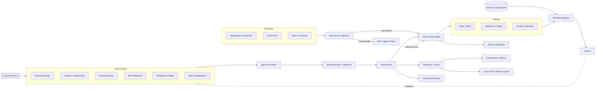

# 🧞 Wish: Omni Event Fabric & Action Engine

## 📋 Context & Objective

### 🎯 Primary Goal
Transform Omni from a channel-specific reply relay into a universal, event-driven platform: every event from every integration is captured once, normalized, routed through configurable actions/guardrails, and stored in a provider-agnostic data model accessible to agents and future UIs.

### 🧭 Wish Purpose
Provide a perfectly organized option map for Omni’s next evolution so humans can evaluate every capability, decide what matters, and stage delivery without yet committing to build plans. Treat this as the strategic roster of possibilities—the place where we keep or cut ideas before implementation wishes spin up. Once this wish locks, it will seed a high-level roadmap, then subwishes, and only then Forge tasks for delivery teams.

## 🧠 Executive Report (Visual Summary)
- **Priority Pulse**
  - `[~]` Phase 1 – Event Fabric Foundation is approved and hot (schema, ingestion, migration work starts immediately).
  - Identity & Lookup upgrade is queued behind Phase 1; the lookup feature (“find Mom across my handles”) is earmarked for a dedicated future wish.

- **Current Database Snapshot** *(captured via `sqlite3 data/automagik-omni.db`)*
  - Core tables: `instance_configs`, `users`, `message_traces`, `trace_payloads`, `user_external_ids`, `access_rules`, `allowed_users`, `alembic_version`.
  - `users` is WhatsApp-centric (requires `phone_number`, `whatsapp_jid`, `instance_name`).
  - `user_external_ids` links additional provider handles but still FK’s into `users`.
  - `message_traces` stores WhatsApp-flavoured fields (`sender_phone`, `sender_jid`, `whatsapp_message_id`).

- **Proposed Identity Evolution**
  - New tables: `omni_identities` (neutral entity/person metadata) + `omni_identity_handles` (provider/handle/instance, primary flag, metadata).
  - Migration steps: backfill one identity per `users` row, port `user_external_ids` into handles, add `identity_id` FK to `users`, keep WhatsApp flows untouched during cutover.
  - Service plan: introduce `identity_service`; `user_service` becomes WhatsApp adapter; Discord and future channels resolve identities directly.
  - Event ingest: resolve/store `identity_id` alongside existing sender/recipient IDs; `omni_events` will make it first-class, allowing retirement of WhatsApp-only columns.

- **Key Decisions Pending**
  - Workflow configuration format & runtime (YAML vs. alternatives, inline vs. queued execution, representative scenarios).
  - Retention/offload plan for `omni_events` + raw archive (TTL, encryption, S3 strategy, sign-off owner).
  - Migration sequencing for legacy tables (`message_traces`, `trace_payloads`) to avoid telemetry regression.

- **Upcoming Feature Concepts**
  - Identity lookup service (Phase 2+): agent-friendly search across all handles with preferred-channel routing.
  - History as a primitive: agents query canonical event store for cross-channel timelines once `omni_events` lands.

## 🧾 Onboarding Prompt (for Incoming Agents)

```
[TASK]
Refine the Omni Event Fabric & Action Engine wish alongside humans so it becomes the definitive, prioritized roadmap.
Treat every pass as a conversation: surface findings, confirm direction, and never advance planning without human commentary or approval.
@genie/wishes/omni-event-fabric-and-action-engine.md

<task_breakdown>
1. [Discovery] Validate every statement in the wish
   - Investigate referenced modules/tests in the repo
   - Cross-check assumptions with live code and data artifacts
   - Review the most recent interaction logs and interview the human for context, unknowns, and priorities before shaping edits

2. [Implementation] Curate the wish content with human approval
   - Highlight conflicting facts or missing evidence
   - Propose reorganizations (dependencies, priority bands, phase buckets)
   - Offer to research any outstanding Open Questions (see section below) before drafting updates, and share the plan with the human for sign-off
   - Apply only human-approved edits via incremental patches

3. [Verification] Confirm the document is decision-ready
   - Summarize evidence for each major pillar and confirm alignment with the human
   - Ensure open questions are current, owners/progress noted, and invite the human to prioritize which to tackle next
   - Capture human acknowledgements before closing the loop
</task_breakdown>

[CONTEXT]
- Purpose: help humans decide what stays, what gaps exist, and how to stage delivery.
- Scope: validation + doc refinement only; never ship features from this wish.
- Tools: repo exploration (`rg`, `uv run ...`), targeted scripts, and human interviews.

[SUCCESS CRITERIA]
✅ Every claim in the wish is either backed by codebase evidence or tagged for follow-up
✅ Document stays perfectly organized by dependencies, priorities, and roadmap phases
✅ Human decisions and rationales captured in-line (no silent updates)
✅ Open questions list remains current with owners/next steps

[NEVER DO]
❌ Skip validation—assumptions must be proven or surfaced as risks
❌ Restructure or trim content without human sign-off
❌ Create Forge tasks or implementation subwishes from this document; roadmap decisions come first, delivery wishes follow later
❌ Leave ambiguous statements; clarify with human or flag explicitly

[WORKSTYLE]
- Default to evidence-first: cite file paths, line refs, or command outputs.
- Treat the human as chief editor—present options, gather direction, then act.
- Before editing, ping the human with a short list of open questions you can investigate (repo search, docs, evidence gathering) and offer to run those dives on their behalf.
- Track progress against the roadmap phases; note impacts of proposed changes.
- Close each session with a status snapshot + refreshed decision log.
```

### Status Legend
- `[x]` committed / already in place
- `[~]` in motion / partially validated
- `[ ]` concept awaiting human approval (feel free to toggle/check and add comments inline)

## 🕰️ Chronological Progression

### Phase 0A – Context Intake (2025-09-26T04:56:50.754895+00:00)
- [x] Phase set to concept consolidation; GENIE orchestrates while implementation agents wait for spec lock.
- [x] Manual capture toolkit staged; `message_table_draft.csv` + `data/raw_webhook_events.jsonl` reference a baseline event catalogue row-by-row.
- [x] Raw webhook capture lives in a manual sidecar listener (`scripts/raw_webhook_listener.py`) plus helper (`src/utils/raw_webhook_store.py`); production still relies on humans to trigger captures until the event fabric lands.
- [x] `message_table_draft.csv` built from authentic payloads (stickers, polls) but still tied to legacy naming.
- [x] Legacy stack: `src/channels/**/*` + `src/services/**/*` orchestrate ingest/routing with WhatsApp-centric assumptions.
- [x] No public launch → we can replace tables/files without back-compat constraints, provided telemetry isn’t dropped.

### Phase 0B – Background Systems Scan
- [x] Incoming events flow through WhatsApp-first code: `src/channels/whatsapp/*`, `src/services/trace_service.py`, `src/services/message_router.py`. Key fields/hard-coded behaviours reflect Evolution naming.
- [x] `message_traces` / `trace_payloads` store only text/media types; no `protocolMessage`/`viewOnce`/`sticker` coverage. Observability depends on these tables.
- [x] Reply logic is hard-wired in `agent_service.process_whatsapp_message`, mixing transport, persistence, and agent orchestration instead of routing through an engine.
- [x] Recent load tests surfaced new payload types (`stickerMessage`, `pollCreationMessageV3`) that don’t map cleanly to the legacy schema; deletes/transforms arrive as `protocolMessage` but still aren’t persisted.
- [x] Instance configuration already exists (`instance_configs`) but naming blurs “instance vs. connection vs. channel”; needs clarity for future connectors.
- [x] Agents rely on ad hoc trace queries or manual exports; no first-class event query interface.

### Phase 0C – Data Capture Assets
- [x] Manual raw capture sidecar (`scripts/raw_webhook_listener.py`, `src/utils/raw_webhook_store.py`) records webhook payloads into `data/raw_webhook_events.jsonl` whenever a human triggers the listener.
- [x] `message_table_draft.csv` mirrors those captures row-by-row, giving a baseline event catalogue (one event per line) to inspect without replaying JSON.
- [x] `scripts/dump_evolution_events.py` summarizes observed message shapes from both the JSONL file and SQLite traces so we can spot gaps before schema work starts.

### Phase 0D – Evidence & Early Analysis

#### ✅ Signals In Hand
- [x] Phase 0C assets confirm we can capture authentic payloads and review them offline via `data/raw_webhook_events.jsonl` and the derived `message_table_draft.csv` of one-event-per-line samples.
- [x] Schema Samples: `message_table_draft.csv` regenerated from authentic payloads; new columns cover forwarding context, mentions, disappearing mode, and new message types (sticker, poll). Reactions/deletes still missing because the backend never stored protocol events.
- [x] Trace Service Limits: `TraceService._determine_message_type` returns `unknown` for stickers, polls, reactions, view-once types; raw payload logging only happens when tracing is enabled.
- [x] Instance Model: `instance_configs` already maps provider connections; we must preserve the concept while clarifying naming for non-WhatsApp adapters.
- [x] Legacy Footprint: `message_traces` / `trace_payloads` underpin today’s telemetry and traces API but are replaceable—no public launch history forces backward compatibility.
- [x] All ingestion plants under `src/channels` and `src/services`; any new architecture must either wrap or refactor them.

### Phase 0E – Approved Accelerators
- [x] Omni Events foundation is green-lit; Phase 1 work (schema, ingestion, migrations) is now the top priority and must progress immediately after outstanding open questions are resolved.

#### 🚨 Risks & Gaps
Modernization pressure points we must account for regardless of which capabilities we greenlight.
1. **Fragmented Ingest**: Channel-specific handlers (`src/channels/whatsapp/handlers.py`, `src/channels/discord/...`) and service logic (`message_router`, `trace_service`) duplicate patterns and embed provider assumptions.
2. **Incomplete Event Coverage**: No persistence for `protocolMessage`, `viewOnce`, polls, stickers, reactions; action logic can’t trigger on what we don’t store.
3. **Naming Coupled to WhatsApp**: `whatsapp_message_id`, `sender_phone`, `evolution_success`, etc. appear in models, APIs, and CLI tools; needs systematic neutralization.
4. **Manual Workflows**: Guard/action flow is hard-coded (e.g., auto reply) with few knobs—no YAML configs or pipeline registry.
5. **UI Preparation**: Without an event/action catalogue, future UIs can’t show “events observed but not mapped,” limiting discoverability.
6. **Flat Action Flow**: Inbound webhooks go straight to Hive response logic; no intermediate rule engine to apply guardrails like “if fromMe → ignore” or “if forwarded audio → transcribe first.”
7. **Message Store Misalignment**: `message_traces` mixes legacy names (`whatsapp_message_id`) with new semantics and lacks a JSON column for provider metadata, making cross-channel queries brittle.
8. **Agent Context Access**: Agents can’t retrieve historical events via stable APIs—they rely on ad hoc SQL/trace dumps.
9. **Dual Stores Risk**: Capturing raw JSONL plus writing to old tables invites divergence; we need a single canonical storage story.

## 🧰 Foundational Building Blocks

Foundational pillars we can invest in; each bullet is a potential deliverable slice to keep, defer, or drop.

**Event Backbone**
- Introduce `src/omni/events/` module housing ingestion, normalization, and the `omni_events` model (typed fields + JSON payload + provider metadata + context).
- Build a raw payload archive (existing JSONL) plus an accessor for replay/testing.
- Audit WhatsApp-centric naming across `trace_models`, `trace_service`, `message_router`, `instance_configs`, CLI, API DTOs—rename or adapter-map to neutral fields (`provider_message_id`, `contact_handle`, `provider_status`, etc.).
- Replace `message_traces`/`trace_payloads`; rewire `/api/v1/traces`, streaming contexts, telemetry sinks to the new schema.
- Ensure provider extras (`protocolMessage`, `viewOnce`, poll updates, reactions) are persisted.
- Typed columns plus JSON payload fields with enforced UTC timestamps, so agents get structured metadata without losing native provider context.
- Consistent instance abstraction (`instance_name`, `provider`, conversation identifiers) spanning data models (`src/db/trace_models.py`), services (`trace_service.py`, `message_router.py`), API DTOs (`src/api/routes/traces.py`, `/messages.py`), CLI, and configuration (`instance_configs`).
- Omni Identity registry (new table + resolver) provides single source of truth for humans/entities with per-provider handles, respecting existing architecture boundaries.
- Default to a single canonical store—replace dual writes to `message_traces` / `trace_payloads` with new `omni_events` + companion `omni_event_actions` tables.

**Action Engine**
- Add `src/omni/actions/` for action implementations (reply, transcribe, describe, forward, notify). Each action receives the event + context, returns outputs for the registry.
- `src/omni/policies/` hosts guards/filters (allow lists, debouncing, self-routing, partner exceptions, compliance gates).
- `src/omni/registry/`: parse workflow configurations (format TBD) and orchestrate steps (guard → action → smart → persist → meta). Support parameters, branching, and smart decisions.
- `src/omni/playbooks/`: optionally store reusable workflow bundles per persona/instance using the chosen configuration format.
- Rule-driven registry linking event filters to ordered action chains; DSL must express conditions like `from_me`, `is_forwarded`, `view_once`, custom hooks.
- API-first configuration: expose endpoints to list/register actions, guards, and workflows; support per-instance overrides and safe reloads.
- House custom modules under `src/omni/actions/custom/<name>` so bespoke logic stays organized.
- Seed playbooks such as “text → reply”, “forwarded audio → transcribe”, “view-once image → describe”, each mapping to canonical action names.

- Wish API endpoint backed by a “wish agent” with access to event catalogs, action registry, and `omni_events` querying (natural-language in, action/workflow out).
- Contact-aware routing (self chat, partner numbers, VIP lists) configured via the upcoming workflow configuration format.
- Self-message handling (ignore, route to personal agent, log) as guard options.
- Configuration format for workflows/guards (likely YAML or similar) must be defined—needs to be simple, readable, diffable, and validated before execution.
- Introduce Omni Identity Registry: single record per human/entity with provider handles (WhatsApp JIDs, Discord user IDs, email addresses, etc.) and lightweight metadata, plus relationships to instance configs and conversations.

**New Concept – Identity Lookup Feature**
- [ ] Identity lookup service (Phase 2+) that lets agents query “find Mom across my handles” and returns resolved identities + preferred contact channels. Builds on the registry, keeps deployment-per-person semantics, and deserves its own future wish.

### Identity Registry Migration Plan *(pending approval)*
- [ ] Create `omni_identities` table (UUID PK, display/preferred name, optional `entity_type` person/org, profile metadata, timestamps) and `omni_identity_handles` table (identity FK, provider, handle, optional instance_name, is_primary flag, timestamps, JSON metadata).
- [ ] Migration path:
  - Backfill identities from existing `users` records (one identity per user) and attach current WhatsApp handles.
  - Migrate `user_external_ids` rows into `omni_identity_handles`, preserving provider/handle uniqueness and instance scoping (`alembic/versions/7f3a2b1c9a01...py`, `83e35a661e81...py`).
  - Add `identity_id` FK to `users` (nullable during transition) so WhatsApp flows keep running while new channels attach directly to identities.
- [ ] Service updates: introduce `identity_service` helpers so `user_service` becomes a thin wrapper (create/update user still happens, but first resolves the identity, then ensures a WhatsApp handle). Discord/other channels switch to resolve via `omni_identity_handles` instead of forcing WhatsApp users first (`src/channels/discord/bot_manager.py:736`).
- [ ] Ingestion updates: webhook pipelines resolve `identity_id` alongside `sender_id` / `recipient_id`; store on `message_traces` until `omni_events` becomes authoritative, then drop the WhatsApp-only columns.
- [ ] Risk mitigation: keep migrations idempotent, add backfill scripts/tests, and document rollback (drop new tables, restore prior links) before implementation agents begin.

#### Identity Schema – Before vs After
| Layer | Today (SQLite `data/automagik-omni.db`) | Proposed Change | Why It Matters |
| --- | --- | --- | --- |
| Primary entity | `users` (PK `id`, requires `phone_number`, `whatsapp_jid`, `instance_name`) | `omni_identities` (PK `identity_id`, neutral metadata) with legacy `users.identity_id` FK during transition | Decouples identity from WhatsApp so one person/org can span many providers without duplicate rows. |
| Handle storage | `user_external_ids` (FK → `users`, unique `(provider, external_id)`) | `omni_identity_handles` (FK → `omni_identities`, carries provider/handle/instance + metadata) | Keeps existing provider links but lets new channels attach without manufacturing a WhatsApp user first. |
| Incoming webhook resolution | WhatsApp → `user_service.get_or_create_user_by_phone`; Discord resolves via `user_external_ids` then reuses the WhatsApp user (`src/channels/discord/bot_manager.py:736-767`) | New `identity_service` resolves/creates `omni_identities` + handles; `user_service` becomes WhatsApp adapter calling into it | Normalizes ingest across providers and prepares `omni_events` to record `identity_id` natively. |
| Event persistence | `message_traces` stores `sender_phone`, `sender_jid`, `whatsapp_message_id` (`sqlite3 .schema message_traces`) | Add nullable `identity_id` column now; future `omni_events` rows store `identity_id` as first-class column | Enables provider-neutral queries (“show everything from Mom”) and simplifies historical lookups. |
| Lookup UX | Ad hoc (per-channel contact lists, manual matching) | Identity lookup service (Phase 2+) built on the registry | Lets agents ask “find Mom across my handles” and receive canonical identity + preferred channel. |

**Access & Catalogues**
- Event APIs: query events by conversation/contact/type/time plus action outcomes.
- Catalog APIs: per instance → list event types observed, mapped workflows, unmapped events (for UI autopopulation).
- Marketplace JSON: enumerates connectors, guard types, transformers, routing options, validators, persistence hooks, meta actions, smart workflow blocks—with suggested canonical names.

## 🧮 Capability Toggle Matrix
| Pillar | Must-Have Signals | Optional Add-Ons | Notes for Decision |
| --- | --- | --- | --- |
| Event Backbone | Unified `omni_events` schema, raw payload archive, provider-neutral identifiers | Replay tooling, synthetic event generators, event diff tooling | Essential to retire legacy tables; optional tools help testing & onboarding. |
| Action Engine | Guard/action runtime, default WhatsApp playbook, config API | Advanced branching, experiment/toggle framework, marketplace packaging | Decide how advanced the DSL gets in Phase 2 vs. later. |
| Identity & Lookup | Identity registry, conversation resolution, agent query API | Cross-channel identity graph, context graph updates, identity lookup service (“find Mom across handles”), overdue commitment surfacing | Impacts personalization scope and data retention posture. |
| Access & Catalogues | Event search API, per-instance catalog, wish API integration | UI canvas builders, marketplace publishing pipeline | Drives UI roadmap; optional pieces fuel future products. |
| Telemetry & Governance | Metrics parity, ingestion observability, dedupe/idempotency guardrails | Action audit log, cost tracking, holiday rate-limit profiles | Must preserve visibility; extras unlock compliance/financial reporting. | 

## 🔭 Future Vision Snapshot *(Idea Board – review & approve)*
- [ ] **One Event Fabric**: Webhooks from WhatsApp (Evolution), Discord, and future channels land in a unified ingestion pipeline (replacing the legacy “channels/services” split) that drives the new `omni_events` store and a raw payload archive—one timeline, one action engine.
- [ ] **Provider-Agnostic Schema**: Names introduced when Omni was WhatsApp-only (`whatsapp_message_id`, `sender_phone`, `evolution_success`, etc.) are replaced with neutral fields so new integrations “just work,” regardless of channel type.
- [ ] **Action Registry & Playbooks**: YAML-defined workflows describe when/how to invoke guards, actions, smart decisions, and persistence steps per event type, contact, or instance. Today we auto-reply; tomorrow we transcribe, caption, forward, or ignore self-sent broadcasts with declarative rules.
- [ ] **Identity & Smart Retrieval**: wish API endpoint hosts an Omni-wide agent capable of answering natural-language queries (“who hasn’t replied this week?”, “what’s overdue?”) by traversing the event store, surfacing commitments, and triggering follow-up actions.
- [ ] **UI-Ready Catalogues**: APIs expose observed event types, mapped workflows, and gaps so future UIs can pre-populate canvas editors (React Flow style) and surface unmapped events as opportunities.
- [ ] **History As A Primitive**: Agents gain first-class access to the canonical event store, making identity and conversation history queryable across all channels.

## 🗂️ Proposed Target Structure (build atop existing)

| Target Folder | Purpose | Existing Home / Notes |
| --- | --- | --- |
| `src/omni/connections/` | Provider adapters (WhatsApp, Discord, future) with instance configuration helpers. | Replace/absorb `src/channels/*` handlers + clients. Map WhatsApp Evolution client to new adapter. |
| `src/omni/events/` | Event ingestion + enqueuing into `omni_events`; raw payload archiver. | New module; wraps existing webhook entry in `src/api/app.py`. |
| `src/omni/actions/` | Action implementation library (reply, transcribe, forward, notify). | New; house logic currently in `agent_service.process_whatsapp_message`, message_router, etc. |
| `src/omni/policies/` | Guardrails & allow lists (existing allow list logic). | Move `access_control` from `src/services` here. |
| `src/omni/registry/` | Workflow parser/executor (YAML, DSL). | New orchestrator replacing hardcoded chains. |
| `src/omni/playbooks/` | Named workflow bundles per persona/instance. | Optional new folder; workflow config files (format TBD). |
| `src/omni/telemetry/` | Metrics/logging/traces abstraction so existing dashboards keep working with new schema. | Wrap existing telemetry code. |
| `src/omni/utils/` | Shared helpers (ID normalization, conversions). | Many utilities already in `src/utils`; move relevant ones here. |

Existing `src/channels`/`src/services` will gradually be refactored or reduced as functionality migrates into `src/omni/**`. Document bridging steps.

## 🚀 Capability Catalogue *(Idea Board – toggle entries you approve with `[x]`)*
A menu of optional modules we can greenlight now, defer, or drop. Use it to scope near-term playbooks and seed future wishes. Current status: `[ ]` unless otherwise noted; feel free to check items as decisions land and leave inline comments.

### 🎛️ Action Library Concepts
Canonical "lego bricks" the engine understands. Each registry id defines the contract (inputs, outputs, required context fields) and the template we can plug providers into. Templates must capture:
- **What the step does** (e.g., transcribe forwarded audio) and the guardrails it expects (language, duration limits, fallback behaviour).
- **Baseline configuration schema** (parameters, secrets, retry policy) so provider swaps do not change workflow YAML.
- **Fallback sequencing** (primary, secondary, tertiary providers) for reliability-sensitive actions like transcription and agent responses.

- [ ] **Inbound Guards**
  - Allow/deny/block lists (`guard.allowlist`, `guard.denylist`, `guard.blocklist`).
  - Message debouncing & spam filtering (`guard.debounce`, `guard.spam_filter`).
  - Self-chat handling (ignore/reroute/log) (`guard.self_route`).
  - Contact overrides for partners, VIPs, internal teams (`guard.contact_override.<label>`).
  - Language gating and geo fences (`guard.language_gate`, `guard.geofence`).
  - Urgency triage agent (`guard.triage`).
  - Rate limiting & flood control (`guard.rate_limit`, `guard.flood_control`).

- [ ] **Content Transformers**
  - Speech-to-text for forwarded/direct voice notes (`transform.stt.forwarded`, `transform.stt.direct`).
  - Image/video/view-once description (`transform.describe.image`, `transform.describe.video`, `transform.describe.view_once`).
  - Document OCR/contract extraction/regex parsing (`transform.ocr.document`, `transform.extract.contract`, `transform.regex.*`).
  - Translation and language normalization (`transform.translate`, `transform.normalize_language`).
  - Poll summarization and sentiment analysis (`transform.summarize.poll`, `transform.sentiment`).

- [ ] **Routing Actions**
  - Default agent reply and team routing (`route.agent.default`, `route.agent.team`).
  - Personal assistant handoff (`route.agent.personal`).
  - Human escalation and cross-channel forwarding (`route.escalate.human`, `route.forward.cross_channel`).
  - Broadcast workflows (`route.broadcast`).
  - Personal-assistant routing for self chats (`route.personal_assistant`).

- [ ] **Post-Action Validators**
  - Safety/policy/compliance checks (`validate.safety`, `validate.policy`, `validate.compliance`).
  - Smart approval agent (`validate.smart_approval`).
  - Fact-checking and tone/brand audits (`validate.fact_check`, `validate.tone`).

- [ ] **Persistence Hooks**
  - Conversation summaries and tagging (`persist.summary`, `persist.tagging`).
  - Context graph updates (`persist.context.update`).
  - CRM sync, follow-up scheduling, task creation (`persist.crm.sync`, `persist.followup.schedule`, `persist.task.create`).

- [ ] **Meta Actions**
  - Analytics logs and cost tracking (`meta.analytics.log`, `meta.analytics.cost`).
  - Notifications (email, Slack, push) (`meta.notify.email`, `meta.notify.slack`, `meta.notify.push`).
  - Feedback capture and experiment toggles (`meta.feedback.capture`, `meta.experiment.toggle`).

Future wishes can deep-dive each cluster (e.g., Omni Transcription Suite, Omni Safety Guardrails, Omni Identity Lookup) once the core engine ships.

When templates reference external services (e.g., transcription, summarisation, VLLM replies), the library entry should link to a provider matrix capturing supported engines, cost tiers, quality notes, and failover ordering. Marketplace entries (below) surface that matrix to humans.

### 🛒 Marketplace Catalogue Ideas
Human-facing packaging for the same registry ids. Each catalogue entry should spell out which providers power the template, how fallbacks chain together, and what humans must configure (secrets, webhooks, quotas) before enabling it. Think "transcribe audio" ⇒ `transform.stt` template backed by Whisper primary, Deepgram secondary, with latency/quality tags the UI can surface.

Canonical names guide the registry; descriptions stay human-friendly for UI builders.

- [ ] **Connections (`connection.*`)** – WhatsApp/Evolution, Discord, Slack, Email/IMAP, SMS, Telegram, Signal, LinkedIn, X/Twitter DMs, calendar connectors, ticketing/CRM systems, generic webhook/RPA bridges.
- [ ] **Inbound Guards (`guard.*`)** – allow/deny/block lists, debouncing, spam detection, language gating, geo-fencing, smart prioritizers, compliance throttles, per-contact overrides.
- [ ] **Content Transformers (`transform.*`)** – speech-to-text provider bundles (e.g., Whisper, Deepgram, Speechmatics) with fallback rules, multimodal captioning, OCR/contract extraction, translators, poll analysers, knowledge enrichment, semantic extractors.
- [ ] **Routing Actions (`route.*`)** – agent replies (LLM providers, in-house agents), multi-agent fan-out, human escalation, cross-channel forwarding, broadcasts, scheduling handoffs, personal-assistant dispatch, workflow queueing.
- [ ] **Post Validators (`validate.*`)** – safety/compliance filters, fact checkers, redactors, smart approval agents, tone/quality auditors, instruction-following checkers.
- [ ] **Persistence Hooks (`persist.*`)** – summarizers, tagging engines, CRM/ERP sync, follow-up schedulers, memory graph writers, task/TODO generators, analytics snapshots.
- [ ] **Meta / Analytics (`meta.*`)** – BI logging, cost tracking, notification/alert pings, feedback collectors, experiment toggles, KPI monitors.
- [ ] **Smart Workflow Blocks (`workflow.*`)** – decision agents, fallback planners, experiment runners, workflow schedulers, retry/orchestration policies, autonomous monitoring agents.

#### Provider Matrix Draft (Human Review)
| Capability | Registry Template | Provider Stack (Primary → Secondary → Tertiary) | Notes | Status |
| --- | --- | --- | --- | --- |
| Agent Orchestration | `route.agent.default` | Default agent (today) → Specialist personal agent (today) → Forge executor (planned) | Forge executor adds automated plan/run handoffs once Humans approve. | [~] |
| Audio / Video Transcription | `transform.stt.audio` | Groq Whisper → OpenAI Whisper → AssemblyAI | Video flows extract audio first; ensure credentials/quota configured per provider. | [ ] |
| Image Transcription | `transform.describe.image` | Qwen-VLM → Local vision pipeline → OpenAI Vision | Local slot covers self-hosted models for privacy-sensitive deployments. | [ ] |
| Video Understanding | `transform.describe.video` | Google Gemini → Custom agent orchestration → Local vision pipeline | Apple VLM can slot in as fourth-stage fallback once available. | [ ] |

## 💡 Smart Workflow Overlays
- [ ] Smart decision nodes before/after actions (via `workflow.smart_decision`).
- [ ] Branching, loops, scheduling, escalations.
- [ ] Guard/persist/meta steps integrated via declarative configuration (format TBD; YAML is candidate but requires further design).
- [ ] Support multi-step recipes (e.g., transcribe → agent → validator → escalate) with retry policies and scheduled follow-ups.

## 📑 Evidence Log – Phase 0 Orientation (Lead Developer Intake)

### 🧪 Evidence Snapshots
- `rg "whatsapp_message_id"` → confirms WhatsApp-centric identifiers across `src/db/trace_models.py`, `src/services/trace_service.py`, `src/services/streaming_trace_context.py`, `src/services/message_router.py`, and `src/api/routes/traces.py`.
- `rg "sender_phone"` → highlights the same surfaces plus tests, signalling contact identity is currently phone-first.
- `rg "protocolMessage"` → only hits documentation/scripts, so edit/delete events still lack a persistence path.

### ⚙️ Dependencies & Constraints
- Event schema must introduce provider-agnostic participant identity (`actor_id`, `provider_actor_ref`, instance scope) so Discord/email connectors land cleanly in Phase 1.
- Action engine needs an idempotent ingestion contract (provider message id + provider + instance); without it we risk duplicate workflows on retries.
- `data/raw_webhook_events.jsonl` is growing with no documented rotation or export pipeline—risk of storage exhaustion and compliance drift.
- We need clarity on action execution runtime (synchronous vs. queued) to avoid blocking ingestion threads when YAML workflows fan out.

### 🔄 Phase 0 Follow-ups (Pre-Phase Decisions)
- Draft Omni Event Schema RFC capturing identity model, dedupe semantics, status transitions, and storage target (likely Postgres) for human review.
- Inventory every consumer of `message_traces`/`trace_payloads` (APIs, dashboards, CLI, agents) to map adapter needs before deprecation.
- Align with infra/compliance on raw payload retention (S3 offload? TTL?). Document the decision in this wish before locking Phase 1 scope.

## 🧭 Architecture Flowchart (conceptual)


## 📂 Relevant Files & Modules
- `src/api/app.py` – webhook entry routing to the legacy flow; future handoff point once raw capture moves in-app.
- `src/services/trace_service.py` – legacy persistence path that needs to emit generalized event types.
- `src/services/message_router.py` – target insertion point for the action engine.
- `src/services/agent_service.py` – contains hard-coded reply behaviour to migrate into the registry/playbooks.
- `src/utils/raw_webhook_store.py` – shared utility persisting raw payloads for replay/testing.
- `scripts/generate_message_table_from_raw.py` – canonical reference for normalized schema mapping.
- Database: `message_traces`, `trace_payloads`, forthcoming `omni_events`, `omni_event_actions` tables.

## 📂 Files & Modules Affected
- Replace `src/channels/**/*` with new `src/omni/connections/` adapters.
- Refactor `src/services/trace_service.py`, `src/services/message_router.py`, `src/services/access_control.py`, `src/services/agent_service.py` into the new `omni` modules.
- `src/api/app.py`: call new ingestion/App orchestration.
- `src/api/routes/traces.py`, `/messages.py`: update to provider-neutral naming and new event store.
- `message_table_draft.csv`: reorganize to align with new schema once implemented.
- Tests (`tests/test_omni_handlers.py`, etc.) to align with new modules.

## 🔍 Evaluation Checklist for Humans
- Scan the Capability Toggle Matrix to decide which pillars are in or out for the first delivery window.
- Use the Decision Boards to make schema, workflow-runtime, and telemetry choices; capture outcomes in this wish.
- Align the Roadmap Draft with your chosen pillars (Phase 1–4) and note any additions/removals before implementation wishes spawn.
- Confirm ownership for Phase 0 follow-ups (schema RFC, retention policy, migration inventory) so later phases aren’t blocked.

## 🧩 Decision Boards (Human Call Needed)
- **Schema & Storage**: Pick canonical participant identity (new Omni registry vs. existing CRM/instance configs); choose retention/offload policy for `omni_events` and raw archive (TTL, encryption, S3, etc.); agree on dedupe semantics and where the action config lives (DB vs. file-backed).
- **Workflow Engine Shape**: Decide whether workflows execute inline with webhooks or via queued workers; confirm how far we go with DSL expressiveness in Phase 1 vs. later (branching, loops, smart decisions).
- **Identity & Lookup Strategy**: Determine if forwarded media transcripts/descriptions become derived events or metadata; choose whether conversation/thread IDs are normalized across providers or mapped per channel.
- **Telemetry & Governance**: Clarify required dashboards/metrics to preserve; decide if we need a dedicated action execution audit log beyond standard telemetry; align on throttling/rate-limiting policies when multiple rules fire.
- **Migration Story**: Approve the drop plan for `message_traces`/`trace_payloads`, including sequencing across services, APIs, telemetry, cleanup tasks, and tests.

## 🛣️ Roadmap Draft (Deliverable Buckets)
- [x] **Phase 0 – Orientation & Decisions**: Finalize schema/retention/identity choices, catalogue consumers of legacy tables, and approve the workflow DSL surface we’ll start with.
- [~] **Phase 1 – Event Fabric Foundation** *(approved priority)*: Lock the `omni_events` schema + archive, unify ingestion, retire dual writes, replace the manual JSONL sidecar (or fold it into the main app as the canonical capture endpoint), and complete the provider-neutral naming audit.
- [ ] **Phase 2 – Action Engine Runtime**: Stand up the workflow executor, seed core actions/guards, and route the current WhatsApp behaviour through declarative configs with management APIs.
- [ ] **Phase 3 – Smart Access & Catalogues**: Ship event query/search APIs, per-instance catalogues, and wish API integration for orchestration-aware querying.
- [ ] **Phase 4 – Expansion & Connectors**: Migrate remaining channel code, add advanced action packs (view-once, polls, stickers, safety), extend to additional connectors, and harden telemetry/CLI tooling.

## 🗺️ Desired Outcomes
- Every Evolution event—including deletes, polls, stickers, view-once—persists with raw payload and normalized metadata.
- Action registry supports per-instance configuration that decides how to react to each event type/condition.
- Enhanced event table lets agents query user history across channels without manual exports.
- Default WhatsApp auto-reply becomes a configurable playbook instead of hard-coded logic.
- New actions (transcription, summarization, forward-to-human) bolt on with minimal code changes.
- Legacy `message_traces`/`trace_payloads` fully replaced by the new schema while existing telemetry (`/api/v1/traces`, dashboards, metrics) continues to function.

## ✅ Success Criteria
- Every webhook event persists in `omni_events` with raw payload, normalized metadata, provider-neutral field names.
- YAML-defined workflows drive guards/actions/persistence; default behaviour matches current WhatsApp reply flow.
- Action/guard library supports per-number/per-contact routing (e.g., self-chat personal assistant, partner exception).
- Wish API endpoint can query event catalogues and trigger workflows via natural language.
- Event catalog API surfaces observed vs mapped events per instance for future UI autocompletion.
- Legacy tables/files (`message_traces`, `trace_payloads`, `src/channels/**/*`, redundant service code) are retired or adapted without breaking telemetry or traces API.
- Raw payload capture stays integrated in the primary webhook flow (no listener dependency).
- Schema design for `omni_events` (and companion actions table) approved with JSON column for provider payload plus typed metadata columns.
- Action registry specification documented with rule examples (ignore self messages, transcribe forwarded audio, reply to direct text).
- Migration plan keeps existing dashboards/agents working during cutover.
- Event coverage audit confirms `protocolMessage`, `stickerMessage`, `pollCreationMessageV3`, poll updates, reactions, and view-once events are captured or queued as follow-ups.

## ✍️ Next Steps (Pending Approval)
- [~] Design final `omni_events` + `omni_event_actions` schema with provider-neutral names (kick off immediately).
- [ ] Inventory existing `src/channels` / `src/services` functionality; map each file to new module targets (connections, events, actions, policies, registry, telemetry).
- [ ] Audit provider-specific naming across models, services, API routes, CLI; produce rename plan.
- [ ] Define workflow schema (likely YAML) covering conditions, steps, parameters, smart branches, with validation rules.
- [ ] Plan implementer tasks for Phase 1 (ingestion, naming cleanup, initial workflow execution).
- [ ] Draft event/action catalogue API contract (observed types, mappings, gaps, usage counts).
- [ ] Document and decide the workflow configuration format (YAML vs. alternative), including validation and deployment story.
- [ ] Outline action registry DSL with default WhatsApp personal-instance rules (ignore self messages, auto-reply, transcribe forwarded audio).
- [ ] Schedule implementation agents for Phases 1 & 2 once spec is locked.
- [ ] Document current usages of `message_traces` / `trace_payloads` (API routes, services, cleanup tasks) to guide rewiring effort.

## ❓ Open Questions (To Answer Before Build Wishes)
- **Workflow Format & Runtime**
  - Preferred configuration format (YAML, JSON, other) and versioning story?
  - Execute workflows inline with webhook ingestion or via worker queues?
  - What representative scenarios (self-chat assistant, partner exception, forwarded media, VIP routing) must the initial DSL support?

- **Schema & Storage**
  - Canonical participant identity source: new Omni registry vs. existing CRM/instance configs?
  - Retention/offload policy for `omni_events` and raw payload archive (TTL, encryption, S3, deletion workflow)? Who signs off?
  - Should forwarded transcripts/images persist as derived events or metadata on the original message?
  - Normalize conversation/thread IDs across providers or maintain per-channel mapping table?
  - Where do workflow/action configs live (database, file-backed, hybrid) and how do we handle dedupe/idempotency semantics?

- **Operations & Governance**
  - Required dashboards/metrics to preserve during migration?
  - Need a dedicated audit log for action execution outcomes beyond telemetry?
  - How do we throttle/rate-limit when multiple rules fire for the same event?

- **Migration Strategy**
  - Do we phase out `src/channels`/`src/services` with feature flags or hard cut?
  - What’s the approved drop/migration plan for `message_traces` / `trace_payloads` (service updates, APIs, telemetry, cleanup, tests)?

## 📝 Agent Updates Log

### 2025-09-26 00:48 UTC – GENIE
- Brought raw capture online via `scripts/raw_webhook_listener.py`; pointed Evolution webhook to listener for ground-truth payloads.

### 2025-09-26 03:52 UTC – GENIE
- Paired the manual raw capture sidecar (`scripts/raw_webhook_listener.py`) with a helper (`src/utils/raw_webhook_store.py`) so humans can record webhook payloads during discovery sessions.
- Regenerated `message_table_draft.csv` from authentic payloads (19 rows covering text, audio, video, document, contact, location, sticker, poll). Added context columns for forward/mentions/disappearing.
- Added `scripts/dump_evolution_events.py` to summarize event coverage and highlight gaps (no protocolMessage yet, poll/sticker present).
- Articulated Omni Event Fabric wish covering storage, action registry, agent enablement.

### 2025-09-26 04:56 UTC – GENIE
- Replaced outdated wish with new end-to-end plan; catalogued existing channel/service infrastructure, proposed `src/omni/**` structure, action categories, marketplace, YAML workflows, naming audits, and phased roadmap.

### 2025-09-27 00:00 UTC – GENIE (Lead Dev Intake)
- Reviewed the wish, captured Phase 0 orientation findings with supporting evidence snapshots, and surfaced identity/retention/runtime questions for human follow-up.
- Logged Phase 0 follow-ups (schema RFC, consumer inventory, raw archive retention alignment) to unblock Phase 1 planning conversations.
