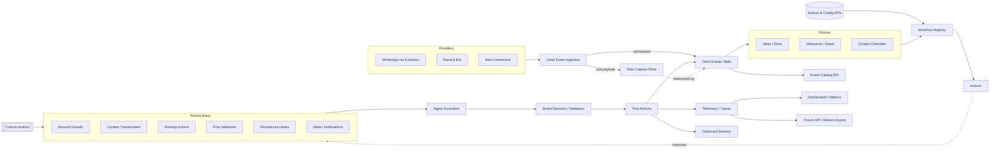

# 🧞 Wish: Omni Event Fabric & Action Engine

## 📋 Context & Objective

### 🎯 Primary Goal
Transform Omni from a channel-specific reply relay into a universal, event-driven platform: every event from every integration is captured once, normalized, routed through configurable actions/guardrails, and stored in a provider-agnostic data model accessible to agents and future UIs.

### 🌐 Vision Snapshot
- **One Event Fabric**: Webhooks from WhatsApp (Evolution), Discord, and future channels land in a unified ingestion pipeline (replacing the legacy “channels/services” split) that drives the new `omni_events` store and a raw payload archive—one timeline, one action engine.
- **Provider-Agnostic Schema**: Names introduced when Omni was WhatsApp-only (`whatsapp_message_id`, `sender_phone`, `evolution_success`, etc.) are replaced with neutral fields so new integrations “just work,” regardless of channel type.
- **Action Registry & Playbooks**: YAML-defined workflows describe when/how to invoke guards, actions, smart decisions, and persistence steps per event type, contact, or instance. Today we auto-reply; tomorrow we transcribe, caption, forward, or ignore self-sent broadcasts with declarative rules.
- **Identity & Smart Retrieval**: `/wish` endpoint hosts an Omni-wide agent capable of answering natural-language queries (“who hasn’t replied this week?”, “what’s overdue?”) by traversing the event store, surfacing commitments, and triggering follow-up actions.
- **UI-Ready Catalogues**: APIs expose observed event types, mapped workflows, and gaps so future UIs can pre-populate canvas editors (React Flow style) and surface unmapped events as opportunities.
- **Memory As A Primitive**: Agents gain first-class access to the canonical event store, making identity, memory, and history queryable across all channels.

### 📊 Current Status (2025-09-26T04:56:50.754895+00:00)
- Phase: Concept consolidation.
- Progress: Raw capture pipeline live, CSV mirrors real payloads, baseline event catalogue started.
- Assigned: GENIE (orchestration); implementation agents pending once spec locks.
- Raw webhook capture is live (`scripts/raw_webhook_listener.py`) and now also integrated in FastAPI (`src/utils/raw_webhook_store.py`).
- `message_table_draft.csv` built from authentic payloads (stickers, polls) but still tied to legacy naming.
- Legacy stack: `src/channels/**/*` + `src/services/**/*` orchestrate ingest/routing with WhatsApp-centric assumptions.
- No public launch → we can replace tables/files without back-compat constraints, provided telemetry isn’t dropped.

### 🔍 Background Context
- Incoming events flow through WhatsApp-first code: `src/channels/whatsapp/*`, `src/services/trace_service.py`, `src/services/message_router.py`. Key fields/hard-coded behaviours reflect Evolution naming.
- `message_traces` / `trace_payloads` store only text/media types; no `protocolMessage`/`viewOnce`/`sticker` coverage. Observability depends on these tables.
- Reply logic is hard-wired in `agent_service.process_whatsapp_message`, mixing transport, persistence, and agent orchestration instead of routing through an engine.
- Recent load tests surfaced new payload types (`stickerMessage`, `pollCreationMessageV3`) that don’t map cleanly to the legacy schema; deletes/transforms arrive as `protocolMessage` but still aren’t persisted.
- Instance configuration already exists (`instance_configs`) but naming blurs “instance vs. connection vs. channel”; needs clarity for future connectors.
- Agents rely on ad hoc trace queries or manual exports; no first-class event query interface.

## 🧠 Shared Knowledge Base

### ✅ Discoveries
- Raw Capture: `scripts/raw_webhook_listener.py` + `src/utils/raw_webhook_store.py` now ingest every Evolution webhook into `data/raw_webhook_events.jsonl`; FastAPI mirrors this so nothing is lost without the listener.
- Schema Samples: `message_table_draft.csv` regenerated from authentic payloads; new columns cover forwarding context, mentions, disappearing mode, and new message types (sticker, poll). Reactions/deletes still missing because the backend never stored protocol events.
- Trace Service Limits: `TraceService._determine_message_type` returns `unknown` for stickers, polls, reactions, view-once types; raw payload logging only happens when tracing is enabled.
- Instance Model: `instance_configs` already maps provider connections; we must preserve the concept while clarifying naming for non-WhatsApp adapters.
- Legacy Footprint: `message_traces` / `trace_payloads` underpin today’s telemetry and traces API but are replaceable—no public launch history forces backward compatibility.
- All ingestion plants under `src/channels` and `src/services`; any new architecture must either wrap or refactor them.

### 🚨 Issues & Gaps
1. **Fragmented Ingest**: Channel-specific handlers (`src/channels/whatsapp/handlers.py`, `src/channels/discord/...`) and service logic (`message_router`, `trace_service`) duplicate patterns and embed provider assumptions.
2. **Incomplete Event Coverage**: No persistence for `protocolMessage`, `viewOnce`, polls, stickers, reactions; action logic can’t trigger on what we don’t store.
3. **Naming Coupled to WhatsApp**: `whatsapp_message_id`, `sender_phone`, `evolution_success`, etc. appear in models, APIs, and CLI tools; needs systematic neutralization.
4. **Manual Workflows**: Guard/action flow is hard-coded (e.g., auto reply) with few knobs—no YAML configs or pipeline registry.
5. **UI Preparation**: Without an event/action catalogue, future UIs can’t show “events observed but not mapped,” limiting discoverability.
6. **Flat Action Flow**: Inbound webhooks go straight to Hive response logic; no intermediate rule engine to apply guardrails like “if fromMe → ignore” or “if forwarded audio → transcribe first.”
7. **Message Store Misalignment**: `message_traces` mixes legacy names (`whatsapp_message_id`) with new semantics and lacks a JSON column for provider metadata, making cross-channel queries brittle.
8. **Agent Context Access**: Agents can’t retrieve historical events via stable APIs—they rely on ad hoc SQL/trace dumps.
9. **Dual Stores Risk**: Capturing raw JSONL plus writing to old tables invites divergence; we need a single canonical storage story.

## 💡 Implementation Ideas

**Event Backbone**
- Introduce `src/omni/events/` module housing ingestion, normalization, and the `omni_events` model (typed fields + JSON payload + provider metadata + context).
- Build a raw payload archive (existing JSONL) plus an accessor for replay/testing.
- Audit WhatsApp-centric naming across `trace_models`, `trace_service`, `message_router`, `instance_configs`, CLI, API DTOs—rename or adapter-map to neutral fields (`provider_message_id`, `contact_handle`, `provider_status`, etc.).
- Replace `message_traces`/`trace_payloads`; rewire `/api/v1/traces`, streaming contexts, telemetry sinks to the new schema.
- Ensure provider extras (`protocolMessage`, `viewOnce`, poll updates, reactions) are persisted.
- Typed columns plus JSON payload fields with enforced UTC timestamps, so agents get structured metadata without losing native provider context.
- Consistent instance abstraction (`instance_name`, `provider`, conversation identifiers) spanning data models (`src/db/trace_models.py`), services (`trace_service.py`, `message_router.py`), API DTOs (`src/api/routes/traces.py`, `/messages.py`), CLI, and configuration (`instance_configs`).
- Default to a single canonical store—replace dual writes to `message_traces` / `trace_payloads` with new `omni_events` + companion `omni_event_actions` tables.

**Action Engine**
- Add `src/omni/actions/` for action implementations (reply, transcribe, describe, forward, notify). Each action receives the event + context, returns outputs for the registry.
- `src/omni/policies/` hosts guards/filters (allow lists, debouncing, self-routing, partner exceptions, compliance gates).
- `src/omni/registry/`: parse workflow configurations (format TBD) and orchestrate steps (guard → action → smart → persist → meta). Support parameters, branching, and smart decisions.
- `src/omni/playbooks/`: optionally store reusable workflow bundles per persona/instance using the chosen configuration format.
- Rule-driven registry linking event filters to ordered action chains; DSL must express conditions like `from_me`, `is_forwarded`, `view_once`, custom hooks.
- API-first configuration: expose endpoints to list/register actions, guards, and workflows; support per-instance overrides and safe reloads.
- House custom modules under `src/omni/actions/custom/<name>` so bespoke logic stays organized.
- Seed playbooks such as “text → reply”, “forwarded audio → transcribe”, “view-once image → describe”, each mapping to canonical action names.

**Identity & Smart Interaction**
- `/wish` endpoint backed by a “wish agent” with access to event catalogs, action registry, and `omni_events` querying (natural-language in, action/workflow out).
- Contact-aware routing (self chat, partner numbers, VIP lists) configured via the upcoming workflow configuration format.
- Self-message handling (ignore, route to personal agent, log) as guard options.
- Configuration format for workflows/guards (likely YAML or similar) must be defined—needs to be simple, readable, diffable, and validated before execution.

**Access & Catalogues**
- Event APIs: query events by conversation/contact/type/time plus action outcomes.
- Catalog APIs: per instance → list event types observed, mapped workflows, unmapped events (for UI autopopulation).
- Marketplace JSON: enumerates connectors, guard types, transformers, routing options, validators, persistence hooks, meta actions, smart workflow blocks—with suggested canonical names.

## 🗂️ Proposed Target Structure (build atop existing)

| Target Folder | Purpose | Existing Home / Notes |
| --- | --- | --- |
| `src/omni/connections/` | Provider adapters (WhatsApp, Discord, future) with instance configuration helpers. | Replace/absorb `src/channels/*` handlers + clients. Map WhatsApp Evolution client to new adapter. |
| `src/omni/events/` | Event ingestion + enqueuing into `omni_events`; raw payload archiver. | New module; wraps existing webhook entry in `src/api/app.py`. |
| `src/omni/actions/` | Action implementation library (reply, transcribe, forward, notify). | New; house logic currently in `agent_service.process_whatsapp_message`, message_router, etc. |
| `src/omni/policies/` | Guardrails & allow lists (existing allow list logic). | Move `access_control` from `src/services` here. |
| `src/omni/registry/` | Workflow parser/executor (YAML, DSL). | New orchestrator replacing hardcoded chains. |
| `src/omni/playbooks/` | Named workflow bundles per persona/instance. | Optional new folder; workflow config files (format TBD). |
| `src/omni/telemetry/` | Metrics/logging/traces abstraction so existing dashboards keep working with new schema. | Wrap existing telemetry code. |
| `src/omni/utils/` | Shared helpers (ID normalization, conversions). | Many utilities already in `src/utils`; move relevant ones here. |

Existing `src/channels`/`src/services` will gradually be refactored or reduced as functionality migrates into `src/omni/**`. Document bridging steps.

## 🎛️ Action Library Concepts
These are the core building blocks. Each line pairs a natural-language description with a proposed canonical registry id.

**Inbound Guards**
- Allow/deny/block lists (`guard.allowlist`, `guard.denylist`, `guard.blocklist`).
- Message debouncing & spam filtering (`guard.debounce`, `guard.spam_filter`).
- Self-chat handling (ignore/reroute/log) (`guard.self_route`).
- Contact overrides for partners, VIPs, internal teams (`guard.contact_override.<label>`).
- Language gating and geo fences (`guard.language_gate`, `guard.geofence`).
- Urgency triage agent (`guard.triage`).
- Rate limiting & flood control (`guard.rate_limit`, `guard.flood_control`).

**Content Transformers**
- Speech-to-text for forwarded/direct voice notes (`transform.stt.forwarded`, `transform.stt.direct`).
- Image/video/view-once description (`transform.describe.image`, `transform.describe.video`, `transform.describe.view_once`).
- Document OCR/contract extraction/regex parsing (`transform.ocr.document`, `transform.extract.contract`, `transform.regex.*`).
- Translation and language normalization (`transform.translate`, `transform.normalize_language`).
- Poll summarization and sentiment analysis (`transform.summarize.poll`, `transform.sentiment`).

**Routing Actions**
- Default agent reply and team routing (`route.agent.default`, `route.agent.team`).
- Personal assistant handoff (`route.agent.personal`).
- Human escalation and cross-channel forwarding (`route.escalate.human`, `route.forward.cross_channel`).
- Broadcast workflows (`route.broadcast`).
- Personal-assistant routing for self chats (`route.personal_assistant`).

**Post-Action Validators**
- Safety/policy/compliance checks (`validate.safety`, `validate.policy`, `validate.compliance`).
- Smart approval agent (`validate.smart_approval`).
- Fact-checking and tone/brand audits (`validate.fact_check`, `validate.tone`).

**Persistence Hooks**
- Conversation summaries and tagging (`persist.summary`, `persist.tagging`).
- Memory graph updates (`persist.memory.update`).
- CRM sync, follow-up scheduling, task creation (`persist.crm.sync`, `persist.followup.schedule`, `persist.task.create`).

**Meta Actions**
- Analytics logs and cost tracking (`meta.analytics.log`, `meta.analytics.cost`).
- Notifications (email, Slack, push) (`meta.notify.email`, `meta.notify.slack`, `meta.notify.push`).
- Feedback capture and experiment toggles (`meta.feedback.capture`, `meta.experiment.toggle`).

Future wishes can deep-dive each cluster (e.g., Omni Transcription Suite, Omni Safety Guardrails, Omni Memory Builder) once the core engine ships.

## 🛒 Marketplace Catalogue Ideas
Canonical names guide the registry; descriptions stay human-friendly for UI builders.

- **Connections (`connection.*`)** – WhatsApp/Evolution, Discord, Slack, Email/IMAP, SMS, Telegram, Signal, LinkedIn, X/Twitter DMs, calendar connectors, ticketing/CRM systems, generic webhook/RPA bridges.
- **Inbound Guards (`guard.*`)** – allow/deny/block lists, debouncing, spam detection, language gating, geo-fencing, smart prioritizers, compliance throttles, per-contact overrides.
- **Content Transformers (`transform.*`)** – speech-to-text providers, multimodal captioning, OCR/contract extraction, translators, poll analysers, knowledge enrichment, semantic extractors.
- **Routing Actions (`route.*`)** – agent replies, multi-agent fan-out, human escalation, cross-channel forwarding, broadcasts, scheduling handoffs, personal-assistant dispatch, workflow queueing.
- **Post Validators (`validate.*`)** – safety/compliance filters, fact checkers, redactors, smart approval agents, tone/quality auditors, instruction-following checkers.
- **Persistence Hooks (`persist.*`)** – summarizers, tagging engines, CRM/ERP sync, follow-up schedulers, memory graph writers, task/TODO generators, analytics snapshots.
- **Meta / Analytics (`meta.*`)** – BI logging, cost tracking, notification/alert pings, feedback collectors, experiment toggles, KPI monitors.
- **Smart Workflow Blocks (`workflow.*`)** – decision agents, fallback planners, experiment runners, workflow schedulers, retry/orchestration policies, autonomous monitoring agents.

## 💡 Smart Workflow Overlays
- Smart decision nodes before/after actions (via `workflow.smart_decision`).
- Branching, loops, scheduling, escalations.
- Guard/persist/meta steps integrated via declarative configuration (format TBD; YAML is candidate but requires further design).
- Support multi-step recipes (e.g., transcribe → agent → validator → escalate) with retry policies and scheduled follow-ups.

## 🧭 Phase 0 Orientation – Lead Developer Intake

### 🧪 Evidence Snapshots
- `rg "whatsapp_message_id"` → confirms WhatsApp-centric identifiers across `src/db/trace_models.py`, `src/services/trace_service.py`, `src/services/streaming_trace_context.py`, `src/services/message_router.py`, and `src/api/routes/traces.py`.
- `rg "sender_phone"` → highlights the same surfaces plus tests, signalling contact identity is currently phone-first.
- `rg "protocolMessage"` → only hits documentation/scripts, so edit/delete events still lack a persistence path.

### 📌 Findings To Track
- Event schema must introduce provider-agnostic participant identity (`actor_id`, `provider_actor_ref`, instance scope) so Discord/email connectors land cleanly in Phase 1.
- Action engine needs an idempotent ingestion contract (provider message id + provider + instance); without it we risk duplicate workflows on retries.
- `data/raw_webhook_events.jsonl` is growing with no documented rotation or export pipeline—risk of storage exhaustion and compliance drift.
- We need clarity on action execution runtime (synchronous vs. queued) to avoid blocking ingestion threads when YAML workflows fan out.

### 🔄 Phase 0 Follow-ups
- Draft Omni Event Schema RFC capturing identity model, dedupe semantics, status transitions, and storage target (likely Postgres) for human review.
- Inventory every consumer of `message_traces`/`trace_payloads` (APIs, dashboards, CLI, agents) to map adapter needs before deprecation.
- Align with infra/compliance on raw payload retention (S3 offload? TTL?). Document the decision in this wish before locking Phase 1 scope.

## 🧭 Architecture Flowchart (conceptual)

## 📂 Relevant Files & Modules
- `src/api/app.py` – webhook entry, now capturing raw events and future handoff point to the event engine.
- `src/services/trace_service.py` – legacy persistence path that needs to emit generalized event types.
- `src/services/message_router.py` – target insertion point for the action engine.
- `src/services/agent_service.py` – contains hard-coded reply behaviour to migrate into the registry/playbooks.
- `src/utils/raw_webhook_store.py` – shared utility persisting raw payloads for replay/testing.
- `scripts/generate_message_table_from_raw.py` – canonical reference for normalized schema mapping.
- Database: `message_traces`, `trace_payloads`, forthcoming `omni_events`, `omni_event_actions` tables.

## 📂 Files & Modules Affected
- Replace `src/channels/**/*` with new `src/omni/connections/` adapters.
- Refactor `src/services/trace_service.py`, `src/services/message_router.py`, `src/services/access_control.py`, `src/services/agent_service.py` into the new `omni` modules.
- `src/api/app.py`: call new ingestion/App orchestration.
- `src/api/routes/traces.py`, `/messages.py`: update to provider-neutral naming and new event store.
- `message_table_draft.csv`: reorganize to align with new schema once implemented.
- Tests (`tests/test_omni_handlers.py`, etc.) to align with new modules.

## 🛣️ Proposed Phases

**Phase 1 – Foundation**
- Land raw payload capture (done) and design the new `omni_events` schema + archive accessor.
- Drop `message_traces` / `trace_payloads` in favour of new tables; migrate codepaths and telemetry collectors (`traces` API, streaming context, metrics) to the replacement service.
- Build ingestion adapter module that receives webhook events, stores raw payload, and writes normalized event.
- Audit & rename/adapter all provider-specific names in models/services/routes/CLI.
- Stub YAML workflow loader (parse & validate configs).

**Phase 2 – Action Engine**
- Implement guard/action/post hooks with lightweight executor and seed actions (`reply`, `ignore`, `transcribe`, `describe_image`, `notify`).
- Wire WhatsApp default behaviour through YAML (mirroring today’s flow).
- Expose configuration APIs (list/update workflows, actions, guards).

**Phase 3 – Smart & Catalog**
- Expose search/query APIs for events so agents can consume the event store.
- Add smart decision nodes (`workflow.smart_decision` using `/wish` agent).
- Build per-instance event/action catalogue endpoints (observed vs mapped vs gaps).
- Integrate `/wish` agent with event/action registry for natural-language orchestration.

**Phase 4 – Expansion**
- Migrate remaining channel-specific code (`channels` + `services`) into new modules or retire redundant files.
- Add advanced actions (view-once capture, poll handlers, sticker interpreter) and extend to additional channels (Discord parity) using the same pipeline.
- Harden telemetry, dashboards, CLI (optional) for the new architecture.

## 🗺️ Desired Outcomes
- Every Evolution event—including deletes, polls, stickers, view-once—persists with raw payload and normalized metadata.
- Action registry supports per-instance configuration that decides how to react to each event type/condition.
- Enhanced event table lets agents query user history across channels without manual exports.
- Default WhatsApp auto-reply becomes a configurable playbook instead of hard-coded logic.
- New actions (transcription, summarization, forward-to-human) bolt on with minimal code changes.
- Legacy `message_traces`/`trace_payloads` fully replaced by the new schema while existing telemetry (`/api/v1/traces`, dashboards, metrics) continues to function.

## ✅ Success Criteria
- Every webhook event persists in `omni_events` with raw payload, normalized metadata, provider-neutral field names.
- YAML-defined workflows drive guards/actions/persistence; default behaviour matches current WhatsApp reply flow.
- Action/guard library supports per-number/per-contact routing (e.g., self-chat personal assistant, partner exception).
- `/wish` endpoint can query event catalogues and trigger workflows via natural language.
- Event catalog API surfaces observed vs mapped events per instance for future UI autocompletion.
- Legacy tables/files (`message_traces`, `trace_payloads`, `src/channels/**/*`, redundant service code) are retired or adapted without breaking telemetry or traces API.
- Raw payload capture stays integrated in the primary webhook flow (no listener dependency).
- Schema design for `omni_events` (and companion actions table) approved with JSON column for provider payload plus typed metadata columns.
- Action registry specification documented with rule examples (ignore self messages, transcribe forwarded audio, reply to direct text).
- Migration plan keeps existing dashboards/agents working during cutover.
- Event coverage audit confirms `protocolMessage`, `stickerMessage`, `pollCreationMessageV3`, poll updates, reactions, and view-once events are captured or queued as follow-ups.

## ✍️ Next Steps (Pending Approval)
- Design final `omni_events` + `omni_event_actions` schema with provider-neutral names.
- Inventory existing `src/channels` / `src/services` functionality; map each file to new module targets (connections, events, actions, policies, registry, telemetry).
- Audit provider-specific naming across models, services, API routes, CLI; produce rename plan.
- Define workflow schema (likely YAML) covering conditions, steps, parameters, smart branches, with validation rules.
- Plan implementer tasks for Phase 1 (ingestion, naming cleanup, initial workflow execution).
- Draft event/action catalogue API contract (observed types, mappings, gaps, usage counts).
- Document and decide the workflow configuration format (YAML vs. alternative), including validation and deployment story.
- Outline action registry DSL with default WhatsApp personal-instance rules (ignore self messages, auto-reply, transcribe forwarded audio).
- Schedule implementation agents for Phases 1 & 2 once spec is locked.
- Document current usages of `message_traces` / `trace_payloads` (API routes, services, cleanup tasks) to guide rewiring effort.

## ❓ Open Questions
- What is the final configuration format for workflows/guards/actions (YAML, JSON, other)? How do we validate and version it?
- Do we need a migration path for existing `src/channels/`/`src/services/` modules during the transition, or can we sunset them incrementally with feature flags?
- How should telemetry metrics map from legacy tables to `omni_events`? Which dashboards must be preserved?
- Gather representative workflow scenarios (self-chat assistant, partner exception, forwarded media processing, VIP routing) to ensure the configuration format is expressive enough without complexity.
- What becomes the canonical contact identity source (new Omni participant registry vs. existing CRM/instance configs)?
- Who approves retention/dedup policies for `omni_events` and the raw payload archive (TTL, encryption, offload strategy)?
- Should action execution stay inline with webhook ingestion or hand off to a worker queue to protect SLA? Need human call before locking Phase 1 scope.
- Where should action configuration live (database vs. file-backed) to allow safe reloads and per-instance overrides?
- Should forwarded transcripts/images be stored as derived events or metadata on the original message?
- Do we normalize conversation/thread IDs across channels or maintain a provider-specific mapping table?
- Do we need a dedicated audit log for action execution outcomes (success/failure) beyond standard telemetry?
- How do we throttle/rate-limit actions when multiple rules fire on the same event?
- Confirm the drop/migration strategy for `message_traces` / `trace_payloads` and sequence the rewiring (trace service, traces API, telemetry metrics, cleanup tasks, tests).

## 📝 Agent Updates Log

### 2025-09-26 00:48 UTC – GENIE
- Brought raw capture online via `scripts/raw_webhook_listener.py`; pointed Evolution webhook to listener for ground-truth payloads.

### 2025-09-26 03:52 UTC – GENIE
- Integrated raw capture into FastAPI handler (`src/utils/raw_webhook_store.py`), ensuring production captures event stream even without listener.
- Regenerated `message_table_draft.csv` from authentic payloads (19 rows covering text, audio, video, document, contact, location, sticker, poll). Added context columns for forward/mentions/disappearing.
- Added `scripts/dump_evolution_events.py` to summarize event coverage and highlight gaps (no protocolMessage yet, poll/sticker present).
- Articulated Omni Event Fabric wish covering storage, action registry, agent enablement.

### 2025-09-26 04:56 UTC – GENIE
- Replaced outdated wish with new end-to-end plan; catalogued existing channel/service infrastructure, proposed `src/omni/**` structure, action categories, marketplace, YAML workflows, naming audits, and phased roadmap.

### 2025-09-27 00:00 UTC – GENIE (Lead Dev Intake)
- Reviewed the wish, captured Phase 0 orientation findings with supporting evidence snapshots, and surfaced identity/retention/runtime questions for human follow-up.
- Logged Phase 0 follow-ups (schema RFC, consumer inventory, raw archive retention alignment) to unblock Phase 1 planning conversations.
